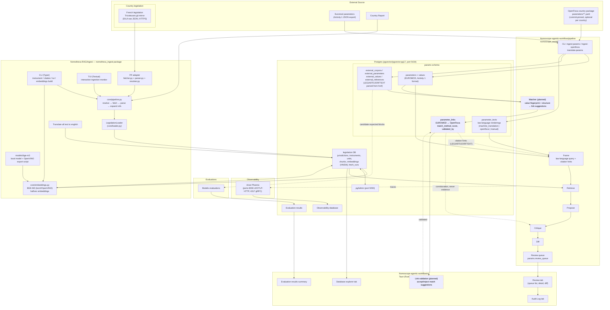

# JRC Expert Contract — Project Overview & Master Plan

**Client:** JRC.B.2 (Fiscal Policy Analysis Unit), Directorate B, Seville
**Goal:** Pipeline that partially automates the update & validation of EUROMOD (and potentially EDGE-M3 / DIRECT) fiscal parameters via a multilingual RAG system + agentic workflow, for 5 pilot member states.

---

## 1. Mission in one sentence

Build (with the JRC.B.2 IT team) a temporally-aware, multilingual RAG over fiscal legislation of 5 EU member states, plug it into an agentic workflow that proposes parameter updates in a structured format, expose the proposals in a validation UI, and evaluate the whole thing with a KPI-driven validation dataset and a co-authored technical report.

## 2. Deliverables, effort and deadlines

| # | Activity | Units | € | Deadline | Deliverable |
|---|----------|-------|---|----------|-------------|
| 1 | Policy Parameter format | 15 | - | **1 Aug 2026** | Spec document for parameter format |
| 2 | RAG architecture & implementation | 100 | - | **15 Nov 2026** | Architecture proposal document (interim payment after 1+2) |
| 3 | Agentic workflow | 80 | - | **15 Dec 2026** | Architecture documentation |
| 4 | Validation | 35 | - | **15 Dec 2026** | Validation dataset + KPI report |
| 5 | Technical report | 30 | - | **31 Dec 2026** | Co-authored report (multi-country, multi-LLM eval) |
| 6 | On-site meeting Seville (≤3 days) | 30 | - | **31 Dec 2026** | Meeting (best timed during Activities 1–2) |

## 3. Critical-path reading of the timeline

- Activity 1 is due **4 weeks after start** → it must begin at kick-off. It is small (15 units) but everything downstream (RAG output contract, agent output schema, validation ground truth) depends on the parameter format. Treat it as the keystone deliverable.
- Activity 2 is the biggest block (100 units) and gates the interim payment. Architecture proposal is the deliverable — not a finished system — so scope the document as "proposal serving as basis for implementation", with implementation happening jointly with the IT team.
- Activities 3 & 4 land on the same date (15 Dec). Validation dataset construction should start *during* Activity 2 (golden set of parameters per country), not after Activity 3.
- Activity 6 (Seville visit) is explicitly tied to Activities 1–2 → propose scheduling it **September/October 2026**, when the architecture proposal is in draft form and in-person whiteboarding has maximum value.

## 4. Cross-cutting decisions to lock early (kick-off)

1. **Country selection** — jointly decided at kick-off. Criteria stated in the contract: variation in *accessibility* and *language*. Proposed slate for discussion:
   - France (rich open data: Légifrance/DILA, but anti-bot friction — Tricoteuses/Canutes experience), 
   - Ireland (English, common-law drafting style; Hannes already prototyping a JSON DB there),
   - One "hard access" case (e.g. Greece or Bulgaria — non-Latin script, PDF gazettes),
   - One structured-portal case (e.g. Estonia or Finland — strong e-government APIs),
   - One large federal/complex case (e.g. Spain — host country, regional dimension; or Germany).
2. **Which models are in scope for parameters?** Contract says "fiscal models" (plural: EUROMOD, EDGE-M3, DIRECT). Clarify whether Activity 1's format must cover all three or EUROMOD only, with extensibility to the others.
3. **Ground truth of parameters** — restate the hybrid principle: not all EUROMOD parameters are legislation-derivable; some are national-team-sourced. The parameter format must carry provenance/confidence metadata from day one.
4. **Infrastructure constraints** — GitLab (JRC instance) mandatory for versioning; clarify compute/hosting (JRC cloud? AWS Bedrock? on-prem?), allowed LLM endpoints (the report requires *comparing different LLMs*, so multi-provider access is a contractual need — relevant to the ALOHA "OpenAI-only" concern).
5. **Definition of "done" per deliverable** — each activity's acceptance criteria in writing at kick-off (payment is acceptance-gated).

## 5. Working rhythm

- Fortnightly progress calls with JRC (contractual). Propose a standing agenda: progress vs. plan / blockers / decisions needed / next fortnight.
- All docs and code in JRC GitLab from week 1; documentation written continuously, not at deadline.

## 6. File map of this plan

- `01_activity1_parameter-format.md` — spec plan for the policy parameter format
- `02_activity2_rag-architecture.md` — RAG architecture plan
- `03_activity3_agentic-workflow.md` — agentic workflow plan (incl. validation UI)
- `04_activity4_validation.md` — validation dataset & KPI plan
- `05_activity5_technical-report.md` — report skeleton
- `06_kickoff-questions.md` — consolidated question list for the kick-off meeting
- `07_risks-and-decisions.md` — risk register and decision log template

