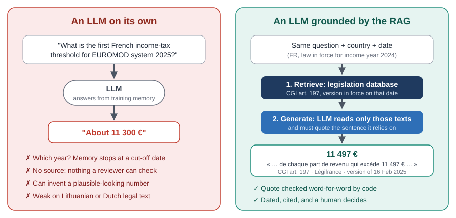
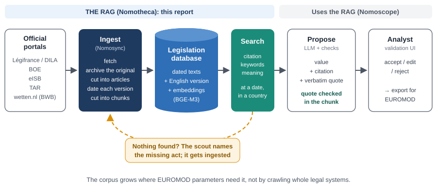
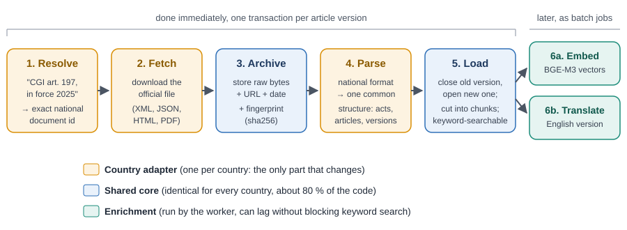
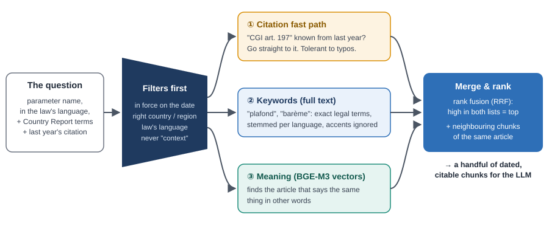
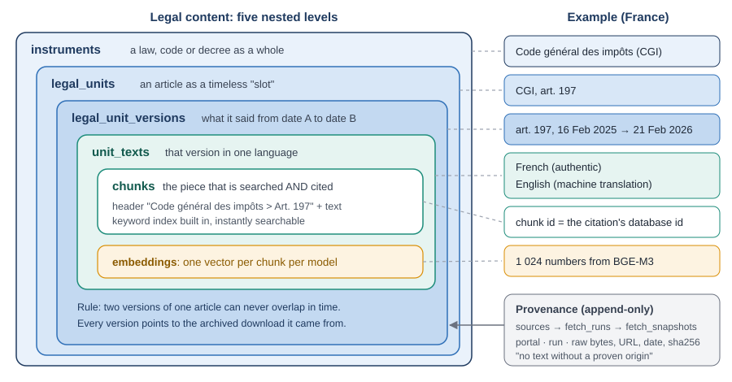
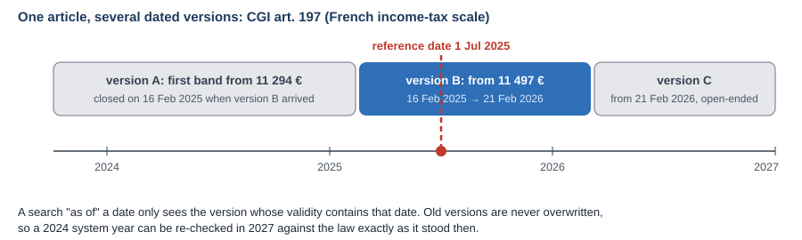
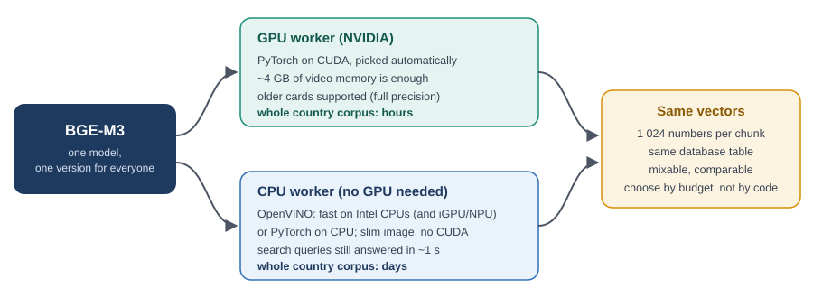
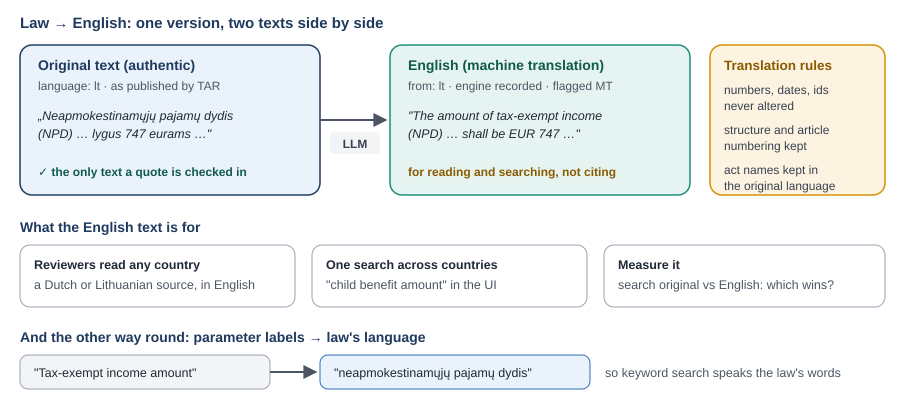
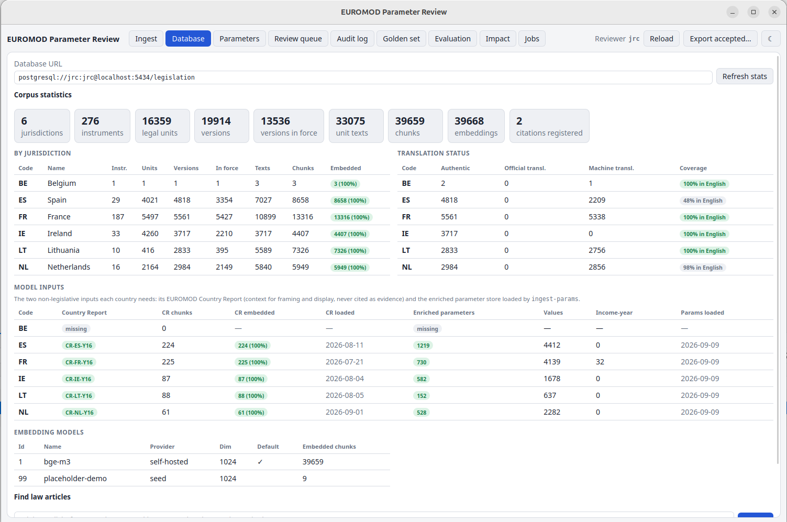

**Audience:** the EUROMOD team at JRC.B.2, national-team colleagues and project stakeholders.
No IT background is assumed. Deployment and hosting questions are covered separately in
[it_needs_for_deployment.md](../docs/it_needs_for_deployment.md).

**Purpose:** explain *why* Nómos is built around a RAG, *what logic* it follows and *how* it
works, at the level needed to trust its output and discuss its evolution, without going into
the code.

---

## In one page

- **The job.** Every year, EUROMOD's fiscal parameters (tax bands, benefit amounts,
  contribution rates) must be checked against new national legislation, in the national
  language. Nómos proposes each update with the article that supports it. A human decides.
- **Why a RAG.** A language model (LLM) on its own answers from memory: it does not know
  which year it is talking about, cannot show a source, and sometimes invents numbers. A
  **RAG** (*Retrieval-Augmented Generation*) first *retrieves* the relevant legal text from our
  own database and only then lets the model *generate* an answer, which it must support with
  a word-for-word quote. Code checks the quote, not the model.
- **The logic.** The library is **built on demand**: we fetch the legislation EUROMOD parameters
  actually depend on, not whole legal systems. Every text is **archived with its origin** and
  **dated**, so the question "what did the law say on 1 July 2025?" has exactly one answer.
- **How it searches.** Three complementary searches run together: *by citation* (last year's
  article), *by keywords* (exact legal terms) and *by meaning* (vectors computed by the
  **BGE-M3** model). Their results are merged into one ranked list.
- **Why BGE-M3.** Open, free, multilingual (Lithuanian and Dutch included), able to read a whole
  article at once, and runnable **inside JRC** so no legal text has to leave.
- **Runs anywhere.** The same model runs on an NVIDIA **GPU** (fast) or on a plain **CPU**
  (slower, no special hardware). Both produce the same vectors.
- **English for everyone.** Every foreign-language article can get an **English machine
  translation**, stored next to the original, so any analyst can read any country. The
  translation helps people read and search. The evidence is always the original text.
- **Pilot.** France, Ireland, Lithuania, the Netherlands and Spain: five languages, five very
  different ways of publishing law.



## 1. Why build a RAG?

### 1.1 The problem we are automating

EUROMOD simulates taxes and benefits for every EU member state. For each country and each
*system year* it holds several hundred numeric parameters: the thresholds of the income-tax
scale, the amount of the child benefit, the ceiling of social contributions, and so on. When a
country passes its annual finance act, or a ministry publishes the new benefit amounts, someone
has to find the right article, read it in the national language, extract the figure and
transcribe it.

That work is slow and needs care, and much of it is repetitive: most of the time the parameter
already cites last year's article, and the task is only to read *the current version* of that
same article. This is the part Nómos automates. Judging whether a figure is right stays with
the analyst.

### 1.2 Why not simply ask an LLM?

Large language models read legal text well in many languages. But asked directly, they answer
**from what they memorised during training**, and that fails in four ways that matter to us:

1. **No notion of "in force on a date".** A model's memory stops at a cut-off date and mixes
   several years together. EUROMOD needs the value for a precise system year.
2. **No source.** An answer from memory cannot be checked. An analyst would have to redo the
   research anyway.
3. **Invented figures.** Models sometimes produce a plausible-looking number that no law
   contains (a "hallucination"). In a fiscal model, a wrong-but-plausible number is the worst
   kind of error.
4. **Uneven language coverage.** Their knowledge of Lithuanian or Dutch legislation is far
   thinner than of French or English.

{width=100%}

### 1.3 What a RAG changes

A RAG splits the work in two:

- **Retrieve.** Our code, not the model, searches a database of official legislation for
  the few passages relevant to *this* parameter, in *this* country, **in force on this date**.
- **Generate.** The model reads only those passages and proposes a value. It must return
  the passage it relied on, **quoted word for word**, together with its reference.

A program then searches for that quote, character for character, inside the cited passage in
the database. If it is not there, the proposal is rejected, however confident the model sounds.
This is the project's main protection against hallucination, and it relies on the retrieval
database: without a stored, identified passage there would be nothing to check the quote
against.

So the RAG is not an optional add-on. It provides the **dates**, the **citations** and the
**verifiable quotes**, the three things an LLM on its own cannot.



## 2. The logic behind our RAG

### 2.1 Mostly a lookup, sometimes a search

The key observation, made at the start of the project, is that **updating a parameter is mostly
a lookup, not an open-ended search**. Most parameters already carry a legal reference from last
year ("CGI art. 197"). The question is then: *give me that article as it read on date X*. Search
engines are only needed for the harder cases: a new act, a renumbered article, a parameter with
no reference, or a value set each year by a separate decree the statute only refers to.

Three designs were weighed:

| Design | Idea | Why not / why yes |
|------|------|----------|
| A. Full library upfront | Download and index all fiscal law of five countries first | Most of it would never be used; huge ingestion cost; endless refresh work |
| B. No library, live web | An agent reads official websites at run time | Most portals cannot show *past* versions; results change between runs; anti-bot blocks mid-run |
| **C. Library built on demand** (chosen) | Fetch what parameters need, archive it, date it, reuse it | Dated, reproducible, cheap; the library grows where EUROMOD lives |

We chose **C**. JRC confirmed at kick-off that an exhaustive legal corpus is not a
deliverable: only the legislation EUROMOD needs.

### 2.2 Five principles

1. **Archive first.** Every downloaded document is stored exactly as received, with its
   address, date and a digital fingerprint, *before* anything is extracted from it. No text
   enters the library without a provable origin. If a reading error is found later, the text
   is re-read from the archive without downloading again.
2. **Dated versions, never overwritten.** When an article changes, the old version is closed on
   the day the new one starts. Both stay. Asking "as of 1 July 2025" selects exactly one.
3. **Legislation is evidence; the rest is context.** Every document carries a *trust class*:
   **evidence** (laws, decrees, orders), **guidance** (circulars, tax-administration doctrine,
   citable but flagged as guidance on every proposal) and **context** (EUROMOD Country Reports,
   never citable). Country Reports describe the model itself, so citing them to support the
   model would be circular. They are still used to translate EUROMOD acronyms into official
   national names.
4. **Scoped by territory.** A Spanish regional parameter (Aragón) can only be supported by
   Spanish national law or Aragón's own acts, never by another region's decree with the same
   number.
5. **One shared core, one adapter per country.** About 80 % of the code is the same for every
   country. What differs (the portal, the file format, the numbering of articles) is isolated
   in a small country adapter. Adding a country means writing an adapter; the rest stays as
   it is.

### 2.3 The big picture

{width=100%}

When a search finds nothing usable, the usual cause is **a missing act**, not a weak model.
For example, the French social-security ceiling is fixed each year by a ministerial order that
no finance act contains. A component called the **scout** then identifies the missing act
(by its official identifier) and hands it to the normal ingestion path. The act is archived,
dated and indexed like any other, and the search runs again. Web search results are only used
to find *which* act to fetch. They are never used as evidence.



## 3. How it works

### 3.1 Ingestion: from a portal to the library

{width=100%}

1. **Resolve.** A human-readable reference ("CGI art. 197, in force 2025") is turned into the
   exact identifier the national system uses (`LEGIARTI…` in France, a `BWBR…` number in the
   Netherlands, a `BOE-A-…` in Spain).
2. **Fetch.** The official file is downloaded from the national open-data source. We never
   crawl: every download starts from a known identifier.
3. **Archive.** The raw bytes are stored with their origin (see §2.2).
4. **Parse.** The national format (XML, JSON, HTML) is converted into one common structure:
   act → articles → dated versions → text.
5. **Load.** Versions are placed on the timeline and each article's text is cut into
   **chunks**, which can be searched by keyword straight away.
6. **Enrich**, later and in bulk: each chunk gets its **embedding** (§4) and, where useful, an
   **English translation** (§6). These run as jobs on the worker and may lag behind loading
   without blocking keyword search.

Re-running an ingestion is harmless: anything already present is recognised and left as it is.

### 3.2 Chunks: the unit of search and of citation

A **chunk** is normally one whole article (or, for a long article, one part of it), preceded by
a short breadcrumb header such as *"Code général des impôts > Art. 197"*. Chunks follow the
legal structure instead of cutting every N words, for two reasons:

- an article is the unit lawyers cite and analysts recognise;
- the chunk's identifier becomes **the reference stored on the proposal** (`jrc_database_id`),
  with the exact position of the quote inside the text. A reviewer can open the exact
  passage from the validation UI.

When a value and its conditions sit in two chunks of the same article, the neighbouring chunk
is brought along automatically.

### 3.3 Retrieval: three searches, one list

{width=100%}

**Before any search**, candidates are restricted to texts *in force on the reference date*, *in
the right country (and region)*, *in the law's language* and *not of trust class "context"*.
Then:

1. **Citation fast path.** If last year's parameter cites an article, go straight to its
   current version. Spelling variations ("art 197 CGI", "CGI, art. 197") are tolerated. This
   covers the common case in one lookup.
2. **Keyword search.** The classic full-text search, in the law's own language: words are
   reduced to their stem (*impôts → impôt*) and accents are ignored. It is precise on exact legal
   terms (*plafond*, *barème*, *décote*).
3. **Meaning search.** Each chunk and each question is turned into a list of 1 024 numbers (an
   *embedding*) that captures its meaning. Texts that say the same thing in different words end
   up close together. This finds the right article when the parameter's name and the law's
   wording differ.

The two ranked lists are merged by **Reciprocal Rank Fusion**: a chunk ranked high by *both*
methods goes to the top. The best few chunks, plus their neighbours, are handed to the model.

The query itself is prepared carefully (the "framing" step of the workflow). A EUROMOD
parameter is a cryptic identifier such as `$tin_upthres1`, so framing uses its native-language
label, the vocabulary of the Country Report (which maps EUROMOD acronyms to official names) and
last year's citation.



## 4. The database: how the tables fit together

### 4.1 Five nested levels of legal content

{width=100%}

Each level answers one question and only that one:

| Table | Answers | Example |
|------|--------|--------|
| `instruments` | Which law, code or decree? | *Code général des impôts* |
| `legal_units` | Which article, as a stable "slot"? | CGI, art. 197 |
| `legal_unit_versions` | What did it say **between which dates**? | art. 197, 16 Feb 2025 → 21 Feb 2026 |
| `unit_texts` | **In which language** is this text? Original or translation? | French (authentic), English (machine translation) |
| `chunks` | Which passage is searched and cited? | the article with its header |

Separating *structure* (the article), *time* (its versions) and *language* (its texts) means
that none of them overwrites another. A new version does not erase the old one, and a
translation does not replace the original.

### 4.2 Time: one answer per date

{width=100%}

The database **forbids** two versions of the same article from overlapping in time. It is a
rule of the database itself, so no program can break it by mistake. As a result, a
point-in-time question is a simple filter and never an approximation. Evaluation runs can also
be **frozen** on a labelled set of downloads, so that comparing two models months apart compares
the models, not two different states of the library.

France adds one complication, handled by the workflow rather than the database: income tax is
assessed on the *previous* year's income. EUROMOD system 2025 therefore needs the scale applied
to 2024 income, which is enacted in the 2025 finance act.

### 4.3 The supporting tables

| Group | Tables | Role |
|----|------|----------|
| **Where from** | `jurisdictions`, `sources` | Countries (and Spanish regions as child territories) and the official portals we read |
| **Provenance** | `fetch_runs`, `fetch_snapshots` | Each ingestion run and every raw file it downloaded, with URL, date and fingerprint. Append-only: nothing is ever deleted or changed |
| **Search** | `embeddings`, `embedding_models`, `lang_fts_config` | One vector per chunk *per model* (so several models can be compared side by side), and the keyword-search settings for each language |
| **Links between acts** | `instrument_relations` | "Finance act 2025 amends CGI art. 197": kept for traceability, never used to decide what is in force |
| **Who cites what** | `citation_registry` | Which EUROMOD parameters rely on which article, to answer "if this article changes, which parameters are affected?" and to prevent deleting a cited text |

EUROMOD parameters themselves are **not** stored in this database. They live in their own schema
and point to legislation **by reference only**, through the chunk identifier.



## 5. The embedding model: BGE-M3

### 5.1 What an embedding model does

An embedding model reads a text and returns a fixed-length list of numbers (for BGE-M3, 1 024
of them) such that **texts with similar meaning get similar numbers**. Comparing the numbers of
a question with those of every chunk gives the "meaning search" of §3.3. The same model must be
used for the library and for the questions, otherwise the numbers are not comparable.

### 5.2 Why we chose BGE-M3

**BGE-M3** (from the Beijing Academy of Artificial Intelligence, `BAAI/bge-m3`) was chosen
against the project's own constraints:

| Requirement | Why it matters here | BGE-M3 |
|------|--------|--------|
| **Multilingual** | Five pilot languages today, 24 EU languages tomorrow; keyword search is weakest in Lithuanian (no stemmer available) | Trained on 100+ languages, including Lithuanian, Dutch, Spanish, French and Irish |
| **Long input** | A legal article can be long; cutting it loses context | Reads up to ~8 000 tokens: most articles fit as one chunk |
| **Runs at JRC** | No legal text or query should have to leave JRC while the model-hosting policy is open | Open weights, runs on JRC hardware, no external API |
| **Free and open licence** | Redistribution to JRC and reuse by other services | MIT licence |
| **Modest hardware** | Must run on a standard GPU or even on CPU | ~570 M parameters; ~4 GB of GPU memory |
| **Strong retrieval quality** | Finds the right article | Among the best open multilingual retrieval models at selection time |

Alternatives considered for comparison: `multilingual-e5-large` (shorter input), `jina-embeddings-v3`
(licence to check) and OpenAI's `text-embedding-3-large` (external API, only if JRC policy
allows it). The database keeps one vector per chunk **per model**, so these can be added side by
side and compared in the final report without changing the design. Changing the default model
means recomputing every vector, which is why we stay with BGE-M3 unless the evaluation shows a
clear gain.

### 5.3 CPU or GPU: the same result, different speed

{width=100%}

All model work happens in one place, the **worker** (*Nomergon*). Analysts' workstations never
load the model. The worker exists in two builds from the same recipe:

- **GPU build (NVIDIA).** The model runs with PyTorch on CUDA; the GPU is detected
  automatically. About 4 GB of video memory is enough, and older cards are supported (they
  run in full precision). Embedding a whole country's corpus takes **hours**.
- **CPU build.** No graphics card and no CUDA libraries needed, so the image is much smaller.
  On Intel processors the model runs through **OpenVINO**, Intel's optimised runtime (which can
  also use the Intel integrated GPU or NPU). Embedding a whole corpus takes **days**, but a
  single search question is still encoded in about a second.

Both builds produce **the same vectors** in the same table. The choice between them is about
budget and speed and has no effect on results. The usual pattern: bulk embedding on a GPU
(overnight batches), everyday searching on whichever machine is available.



## 6. Translation into English

### 6.1 Why translate

The EUROMOD team works in English, but the law of four of the five pilot countries is not
written in English. A reviewer asked to accept a Lithuanian or Dutch figure needs to understand
the article that supports it. So every article version can receive an **English machine
translation**, produced by an LLM as a batch job on the worker.

{width=100%}

### 6.2 How it is done

- The translation is stored **next to** the original, as a second text of the same article
  version, labelled *machine translation*, with its source language and the engine that
  produced it. The original is never modified.
- The translator is instructed to **never alter numbers, amounts, dates or legal
  identifiers**, to keep the article's structure and numbering, and to keep official act names
  in the original language.
- The English text is cut into chunks and embedded like any other, so it can be searched.
- The job is repeatable: articles already translated are skipped, and a changed original can
  be re-translated.

### 6.3 What it is used for, and what not

| Used for | Not used for |
|---|---|
| Reading any country's source in the validation UI, next to the original | **Evidence.** The quote supporting a proposal is always checked in the **original, authentic** text |
| Searching all countries at once in English from the UI's database tab | Replacing an official translation where one exists (those are stored as *official translation*) |
| Measuring whether searching in the original language or in English finds the right article more often (a question the contract asks) | |

Each proposal also carries the model's English rendering of its quote, so the reviewer reads
the key sentence in English without opening the source.

**The other direction.** EUROMOD's own parameter labels are in English, while keyword search
works in the law's language. The workflow therefore also translates each parameter's label
*into* the law's language ("tax-exempt income amount" → *neapmokestinamųjų pajamų dydis*),
so that keyword search uses the same words as the law.



## 7. The pilot countries

The contract asked for five member states that **differ in language and in how accessible their
law is**. The pilot covers:

| Country | Official source we read | What makes it interesting |
|------|----------|--------------|
| **France** (French) | DILA open data (LEGI + JORF), via the Tricoteuses daily mirror. Ids `JORFTEXT…`, `LEGIARTI…`, ELI | Richest data, with dated consolidated versions of every code article. Légifrance itself is protected by anti-bot measures, so we read the open-data dumps instead. Income tax is dated by *income year* |
| **Ireland** (English, Irish) | Irish Statute Book (eISB), with the Oireachtas API to locate acts. Ids like `1997/act/39`, ELI | Common-law drafting (Acts, sections, Statutory Instruments); no translation needed; acts mostly available as enacted rather than consolidated |
| **Lithuania** (Lithuanian) | Register of Legal Acts (TAR), via the national open-data API. `TAR…` document ids | Official API with dated consolidations; no stemmer for keyword search, so meaning search matters most; never-amended acts have no consolidation and are read from the original |
| **Netherlands** (Dutch) | Basiswettenbestand (BWB), the official consolidated XML behind wetten.overheid.nl. `BWBR…` ids | Dated consolidations per act; no ELI; some formulas published as images |
| **Spain** (Spanish) | BOE consolidated-legislation open-data API. `BOE-A-…` ids | Best machine-readable access; adds a **regional** layer: the autonomous communities set their own income-tax rates and allowances, so regions are child territories of Spain |

Belgium is already provided for in the design (its laws are authentic in French *and* Dutch at
the same time, which the database accepts) but is not part of the pilot ingestion.

Adding a sixth country is mostly work on its source: a short analysis of its official portal,
a few configuration rows, and a country adapter (resolve, fetch, parse). The database, the search
and the workflow stay as they are.

## 9. Adding a country

A _skill_ has been prepared in `.claude/skills/add-country/SKILL.md` so a coding agent could handle the task of adding a new country with a single command: `/add-country Belgium`.

## 10. Interface

The Nomoscope UI display the state of the database:
{width=100%}

Here we can see that the embeddings cover all article, as the translation for XX.

It's possible to start them from the interface by clicking on 

## . Limitation

- **Coverage follows demand.** The library holds what EUROMOD parameters have needed so far.
  A proposal of "not found" is most often a missing act, and the scout is there to close
  such gaps.
- **Enrichment can lag.** A freshly ingested act is searchable by keyword immediately, by
  meaning only once its embeddings are computed, and readable in English once translated.
  The database tab of the UI shows these coverage figures per country.
- **The model's "confidence" is not a probability.** Proposals should be judged on
  mechanical checks: whether the quote was verified, the critique's verdict, the routing.
  The model's self-reported confidence score carries much less information.
- **Humans stay in charge.** Nothing is written into EUROMOD files automatically. Every value is
  accepted, edited or rejected by an analyst, and that decision is recorded permanently.



## Annex A - Vocabulary

The complete glossary is [docs/vocabulary.md](../docs/vocabulary.md). The terms below are the
ones needed for this report.

### Project names

| Term | Meaning |
|---|--------|
| **Nómos** | The whole project (Greek *νόμος*, "law"). |
| **Nomotheca** | The legislation library and its ingester: the RAG described here ("library of laws"). |
| **Nomosync** | The ingestion part of Nomotheca: fetch → archive → parse → chunk → load. |
| **Nomoscope** | The agentic workflow that proposes parameter values, and the validation UI. |
| **Nomokrisis** | The evaluation pipeline that scores the whole chain against a verified *golden set*. |
| **Nomergon** | The worker: the only process that runs models, holds credentials and reaches the internet. |

### Legal and data-source terms

| Term | Meaning |
|---|--------|
| **Instrument** | A law, code, decree or order considered as a whole. |
| **Consolidated version** | The text of an article as it reads after all amendments up to a date, as opposed to the amending act itself. Point-in-time answers come from consolidated versions. |
| **Validity** | The date range during which a version is in force. |
| **Hierarchy of norms** | Statute → government decree → ministerial order → guidance. Many EUROMOD figures are not in the statute but in an annual decree or order it refers to. |
| **ELI** | *European Legislation Identifier*: a standard web address for a legal act. Unevenly deployed across countries, so we never depend on it. |
| **National id** | The identifier each national system actually uses (`LEGIARTI…`, `BWBR…`, `BOE-A-…`, `TAR…`). |
| **Archive-first / snapshot** | The raw downloaded file, stored with origin and fingerprint before being read. |
| **Trust class** | *evidence* (legislation), *guidance* (circulars, doctrine: citable but flagged) or *context* (Country Reports: never citable). |
| **Authenticity** | Whether a text is the *authentic* original, an *official translation* or a *machine translation*. |

### RAG and search terms

| Term | Meaning |
|---|--------|
| **RAG** | *Retrieval-Augmented Generation*: retrieve relevant documents first, then let an LLM answer from them. Ours is **built on demand** rather than crawled upfront. |
| **LLM** | *Large Language Model*: the AI model that reads the retrieved text and proposes a value. |
| **Chunk** | The piece of text that is searched and cited, usually one article with a header. |
| **Embedding / vector** | A list of numbers (1 024 for BGE-M3) representing a text's meaning. Similar meanings get similar numbers. |
| **BGE-M3** | The open multilingual embedding model we use (§5). |
| **Full-text (keyword) search** | Word-based search in the law's language, with stemming and accent-insensitive matching. |
| **Hybrid search** | Keyword and meaning searches run together and merged. |
| **RRF** | *Reciprocal Rank Fusion*: the rule that merges ranked lists, favouring chunks ranked high in both. |
| **Citation fast path** | Going straight to the article last year's parameter cited, before any search. |
| **Scout** | The component that, when nothing is found, identifies the missing act so it can be ingested. |
| **Verbatim check** | The code check that the model's quote appears character for character in the cited chunk. The core anti-hallucination rule. |
| **Hallucination** | A model output not supported by the source, such as an invented figure. |
| **GPU / CPU** | Graphics processor (fast for models) / ordinary processor (slower, no special hardware). |
| **OpenVINO** | Intel's runtime that makes models run fast on Intel CPUs. |

### EUROMOD terms

| Term | Meaning |
|---|--------|
| **System year** | The year a EUROMOD country system represents (`FR_2025`). One workflow run checks one system year. |
| **Reference date (`as_of`)** | The date used to select the law in force. EUROMOD reflects the law as of 30 June, so reference dates are mid-year. |
| **Income year** | For French income tax, system year Y applies the scale for income year Y−1. |
| **Country Report** | EUROMOD's annual description of each country system. Used for vocabulary, never as evidence. |
| **Parameter target** | The address of a parameter, e.g. `euromod://FR/tin_fr/def_const/$tin_upthres1` (country / policy / function / parameter). |

---

**Further reading (technical):** [10_retrieval-strategy-challenge.md](10_retrieval-strategy-challenge.md)
(the choice of an on-demand RAG), [11_database-model.md](11_database-model.md) (database design),
[12_ingestion-architecture.md](12_ingestion-architecture.md) (shared core and country adapters),
and the per-country source analyses in this folder.
