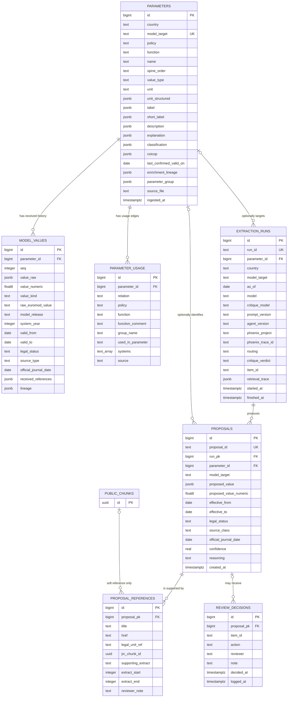
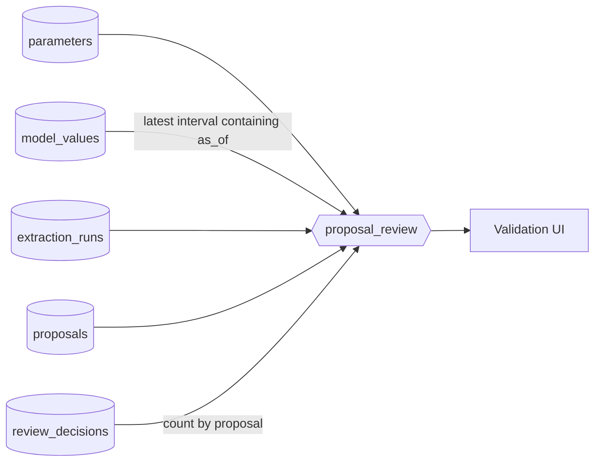

# EUROMOD-Assisted Parameter Update Format - Proposal for Validation

*Draft for discussion with the EUROMOD team.*

## 1. Purpose

The proof of concept assists a person updating EUROMOD parameters. For one existing parameter, it must:

1. receive the parameter and its history from the EUROMOD team;
2. select the relevant model value for a system year;
3. search authoritative sources for a candidate value;
4. show the candidate, exact supporting text, and citation;
5. let a person accept, reject, or request a revision.

The pipeline is **export-first and human-gated**. It never writes directly into EUROMOD.

The proposal is based on the files already received after a first draft format:

- `extracted_parameters/FR.policy.json` - the base parameter export;
- `extracted_parameters/enriched/FR.enriched.json` - the same export with existing enrichment.

The POC should preserve this work rather than introduce a completely different format.

## 2. What is already in the enriched French export

The large file was analysed with `jq`. It contains:

| Observation | Result |
|---|---:|
| Parameter records | 702 |
| Value-history rows | 3,886 |
| Top-level shape | 702 records with `information` and `values` |
| Unique `model_target` values | 702 |
| Exported target kind | 702 `def_const` constants |
| `value_type` | 702 `scalar` |
| Numeric value rows | 2,961 |
| String value rows | 925 |
| Rows whose value is `"n/a"` | 758 |
| Parameters with `coicop` | 227 |
| `usage.defined_in` entries | 705 |
| `usage.used_by` entries | 5,368 |

Every `information` object contains:

```text
country, model_target, spine_order, value_type, unit,
label, short_label, description, explanation,
last_confirmed_valid_on, classification,
usage, enrichment_lineage
```

`coicop` is additionally present for 227 consumption-tax parameters.

Every existing `values[]` row contains:

```text
value, valid_from, valid_to,
legal_status, source_type, official_journal_date,
references, lineage
```

This is already close to the needs of the assisted updater. The main requirement is therefore to identify who supplies or fills each field.

## 3. Data ownership and processing stages

The proposed exchange record keeps the existing `information + values[]` envelope and adds proposal and review blocks. Comments in [`parameter_sample.jsonc`](parameter_sample.jsonc) use the same four labels as this section.

### Stage A - received from the EUROMOD team

For the POC, `FR.enriched.json` is the received input contract. The POC treats its existing content as read-only source data.

The underlying base export already contains:

- `country`, `model_target`, `spine_order`, `value_type`, and `unit`;
- `label`, `description`, `explanation`, and `classification`;
- the complete `values[]` history;
- the raw EUROMOD representation in `values[].lineage.model_answer`;
- the source model identifier in `values[].lineage.model`.

The enriched file additionally contains or improves:

- `short_label` for all 702 parameters;
- `description` for all 702 parameters;
- `usage` for all 702 parameters;
- `enrichment_lineage` for all 702 parameters;
- `coicop` for 227 parameters;
- adjusted `unit` values for 211 parameters.

The comparison found the same 702 targets and no changes to any of the 3,886 value-history rows. This means the enrichment adds context while preserving model values.

The POC must not ask the value-search agent to regenerate labels, descriptions, classification, COICOP, or usage information that has already been supplied.

### Stage B - deterministic POC post-processing

This stage performs small, explainable transformations. It does not use an LLM and does not invent policy facts.

It may add:

- a structured `model_address`, parsed from `model_target`;
- `model_release`, parsed from `values[].lineage.model` when possible;
- `raw_euromod_value`, renamed from `lineage.model_answer` for clarity;
- a structured unit view while preserving the received `unit`;
- an optional `parameter_group`, based on an EUROMOD-team-approved mapping;
- a simple comparison between the current model value and a proposal.

The normalization rules for the POC are intentionally modest:

1. Preserve the received fields for traceability.
2. Convert a received model value of `"n/a"` to normalized `value: null`, but preserve `raw_euromod_value: "n/a"`.
3. Preserve formulas such as `$PSS * 4` or `0.6 * 6/12 + 0.4 * 6/12` as raw text. Formula parsing is not required.
4. Do not infer a legal effective date from a EUROMOD system year.
5. Do not silently correct questionable labels or units. Keep the received value and mark any normalized interpretation as post-processing.

### Stage C - agentic value search

The agent searches legislation or another permitted source and creates a new entry in `proposals[]`. It does not overwrite `values[]`.

The agent may supply:

- `proposed_value`;
- `effective_from` and `effective_to`, only when supported by the source;
- `source_class`;
- `legal_status`, when applicable;
- `official_journal_date`;
- one or more references;
- an exact `supporting_extract`;
- the cited RAG `chunks.id` as `jrc_database_id`;
- extraction lineage and confidence;
- a note explaining uncertainty or why the parameter should be routed to the national team.

The central anti-hallucination rule remains mechanical:

> For legislation-sourced proposals, `supporting_extract` must occur character-for-character in the cited RAG chunk before the proposal can be accepted.

The agent is allowed to say that it cannot determine the value. It must not manufacture a citation or explain a model/legal difference without evidence.

### Stage D - human review

The validation UI appends entries to `review_decisions[]`:

```text
accepted | rejected | needs_revision
```

A decision records the proposal id, reviewer, timestamp, and note. Previous decisions are retained. An empty list means that the proposal is pending.

## 4. Keep the existing parameter identity

The received export uses:

```text
euromod://FR/tinkt_fr/def_const/$tin_upthres1
```

`model_target` remains the canonical compatibility identifier. Then a field `model_address` split it like this:

```json
{
  "country": "FR",
  "policy": "tinkt_fr",
  "function": "def_const",
  "kind": "constant",
  "name": "$tin_upthres1"
}
```

This structured view is derived; it is not a request for the EUROMOD team to change the existing URI immediately. The team should confirm whether these parsed components are correct and sufficient for eventual write-back.

## 5. Keep model history separate from proposals

The received `values[]` rows describe the values found in the exported model. For `$tin_upthres1`, the enriched file contains:

| Model year derived from `valid_from` | Received value | Raw EUROMOD value |
|---:|---:|---|
| 2023 | 10,777 | `10777#y` |
| 2024 | 11,294 | `11294#y` |
| 2025 | 11,496 | `11496#y` |

The cited version of CGI article 197 states `11 497 EUR`. The POC should display both facts:

- **existing model value:** 11,496 for the 2025 system in release J2.19;
- **agent proposal:** 11,497, supported by the cited legal extract.

The agent must not replace the existing history. The reviewer decides whether a model update is appropriate and may ask the national team why the values differ.

### Model release and system year

The received lineage contains:

```text
euromod-connector:EUROMOD_MASTER_VERSION_J2.19
```

Post-processing can derive `model_release: "J2.19"`. For the latest annual row it can select `system_year: 2025` from the interval beginning at `valid_from: "2025-01-01"`.

Some received rows cover several years. In that case `valid_from` and `valid_to` remain the model interval, while `system_year` is the particular year being reviewed within that interval. It must not always be treated as a rename of the `valid_from` year.

Both are useful because a later release may revise the same system year. The original `valid_from`, `valid_to`, and lineage fields remain available until the EUROMOD team confirms that these derivations are reliable across countries.

### Model dates versus legal dates

All 3,886 received `valid_from` dates are 1 January, and every non-null `valid_to` is 31 December. For this POC, these dates are treated as model applicability intervals.

Legal dates belong in the proposal as `effective_from` and `effective_to`. They are filled only when the source establishes them. A legal date may therefore remain `null` even when the system year is known.

## 6. Values and units

### Literal, unavailable, and expression values

The received data uses the same `value` field for several representations:

```json
11496
"n/a"
"$PSS * 4"
"0.6 * 6/12 + 0.4 * 6/12"
```

The normalized POC view uses:

| Received value | Normalized value | Raw value retained |
|---|---|---|
| `11496` | `11496` | `"11496#y"` |
| `"n/a"` | `null` | `"n/a"` |
| `"$PSS * 4"` | `null` | `"$PSS * 4"` |
| weighted expression | `null` | complete expression |

Using `null` means “no normalized scalar is available”; it does not mean zero. Expressions remain visible to the reviewer, but the POC does not evaluate them.

### Units

A field `structured_unit`:

```json
{
  "quantity": "money",
  "currency": "EUR",
  "period": "year",
  "euromod_suffix": "#y"
}
```

This structured unit is a convenience view. It is not allowed to hide the original value because the French data still contains questionable combinations, such as rates labelled `currency`.

## 7. Optional parameter groups

The received export correctly stores schedule components as separate scalar constants:

```text
$tin_upthres1 ... $tin_upthres5
$tin_rate1 ... $tin_rate6
```

The POC keeps every constant and `model_target` unchanged. Post-processing may optionally add:

```json
{
  "id": "FR:tinkt_fr:income_tax_schedule",
  "kind": "bracket_schedule",
  "role": "upper_threshold",
  "index": 1
}
```

This is only a display and retrieval hint. It does not combine values into an array and does not change write-back. Group mappings will be supplied by the EUROMOD team; they should not be inferred from names alone for the POC.

## 8. Source class, legal status, and references

`source_class` answers “where did this candidate value come from?”:

```text
legislation | administrative_guidance | official_statistics | national_team | other
```

`legal_status` answers “what is the lifecycle state of this legal measure?”:

```text
enacted_in_force | enacted_not_yet_in_force | bill_proposed | announced
```

`legal_status` may be `null` for official statistics or national-team values. `national_team` is a source class, not a legal lifecycle status.

For legislation, references attach to the proposal that they support, not to the parameter in general. A reference may include title, article, URL, legal-unit identifier, exact extract, RAG chunk id, and offsets.

## 9. Usage and file size

The received `usage` block is valuable context: it shows where a constant is defined and its 5,368 uses in the model. It should not be discarded.

For the POC there are two acceptable options:

1. keep `usage` in each full exchange record, matching `FR.enriched.json`; or
2. place the unchanged usage graph in a sidecar file or table and keep a `usage_ref` in the compact review record.

Option 2 reduces repeated data sent to the agent and UI. It is an optimization, not a change to the information supplied by the EUROMOD team.

## 10. Minimal POC storage

PostgreSQL remains the proposed canonical store; JSON remains the exchange format.

The minimum tables are:

- `parameters` - received information plus deterministic normalized fields;
- `model_values` - received model history and raw EUROMOD representations;
- `parameter_usage` - received usage graph, optionally stored separately;
- `proposals` - agent-generated candidate values and source metadata;
- `proposal_references` - evidence attached to proposals;
- `extraction_runs` - agent, model, prompt, confidence, and retrieval trace;
- `review_decisions` - append-only human decisions.

This is intentionally smaller than a general fiscal-parameter database.

This schema is implemented as the `params` schema of the shared legislation
database: [agentic-workflow/pipeline/db/params_schema.sql](../agentic-workflow/pipeline/db/params_schema.sql)
(`references` is a reserved SQL word, so that table is named
`proposal_references`). It is applied and populated with:

```bash
cd agentic-workflow/pipeline
uv run euromod-workflow init-param-db
uv run euromod-workflow ingest-params ../../extracted_parameters/enriched/FR.enriched.json
```

Each `extraction_runs` row additionally carries `phoenix_trace_id`, the
OpenTelemetry trace id of that run's root span. A reviewer can open the full
agent process (frame, retrieve, propose, critique, diff) in Arize Phoenix at
`http://localhost:6006/projects/<project-id>/traces/<phoenix_trace_id>`.
This is a soft link for process transparency: the durable evidence remains the
verbatim `supporting_extract` and chunk id on `proposal_references`. The
`params.proposal_review` view joins a proposal, its current model value, and
the trace id as the read surface for the validation UI.

## 11. Required fields and gates

### Required POC input

- received `information.model_target` and `information.country`;
- received `values[]` history;
- received raw model value and connector/model identifier;
- enough received metadata to display the parameter to a reviewer.

### Required agent proposal

- `proposal_id`;
- `proposed_value`, which may be `null` when the agent abstains;
- `source_class`;
- run id and confidence;
- legal dates only when supported by evidence.

### Required before acceptance

- `legal_status` for legislation;
- at least one citation and exact supporting extract for legislation;
- otherwise, an appropriate source reference or explicit national-team note.

`parameter_group`, structured units, offsets, and legal end dates are optional.

## 13. Validation exercise

Validate 5-10 records already present in `FR.enriched.json`:

- one plain statutory amount;
- one rate;
- one `"n/a"` value;
- one raw expression;
- the `$tin_upthres1` model/legal discrepancy;
- optionally, two members of a validated parameter group;
- one parameter routed to the national team.

# Parameter Database Schema

This diagram documents the `params` schema created by
[`agentic-workflow/pipeline/db/params_schema.sql`](../agentic-workflow/pipeline/db/params_schema.sql).
It follows the four-stage ownership model: received EUROMOD data, deterministic
normalization, agent proposals, and append-only human review.



## Relationship Notes

- `parameters.model_target`, `extraction_runs.run_id`, and
  `proposals.proposal_id` are unique business identifiers.
- `model_values` is unique on `(parameter_id, seq)`; proposals never overwrite
  this received value history.
- `extraction_runs.parameter_id` and `proposals.parameter_id` are nullable so a
  run can represent a target that has not been ingested.
- `proposal_references.jrc_chunk_id` is deliberately not a foreign key. It is a
  soft reference to `public.chunks.id`; cited-chunk retention is enforced by
  `public.citation_registry`.
- `review_decisions` is append-only. A row must have either `proposal_pk` or
  `item_id`; `item_id` supports decisions on abstained or `not_found` queue
  items that have no proposal row.
- Phoenix trace IDs are also soft links because Phoenix data can be reset while
  proposal evidence remains durable.

## Review View

`params.proposal_review` is the validation UI read surface. It combines each
proposal with its run, parameter metadata, the model value applicable on the
run's `as_of` date, and a count of review decisions.



The view does not include `proposal_references`; evidence is loaded separately
from the proposal relationship when the reviewer opens citation details.

## Using External Parameter Corpora in the Assisted-Update Pipeline

This chapter focus on OpenFisca-France but it will be generic enought to be used for other sources we may later found.

### 1. What OpenFisca-France offers

OpenFisca-France maintains a human-curated database of French tax-benefit
parameters as YAML files (`openfisca_france/parameters/**.yaml`): **4,012
parameter files, ~2,500 of them carrying legal references**. One file, e.g.
`impot_revenu/bareme_ir_depuis_1945/bareme.yaml`, contains:

- the full value history (the income-tax scale back to 1945), as date-keyed
  scalars or bracket structures;
- per-date `metadata.reference` entries: `{title: "Loi 63-1241 du 19/12/1963
  (LF pour 1964)", href: "https://www.legifrance.gouv.fr/...JORFTEXT000000875392"}`;
- per-date `official_journal_date`;
- `description` and `short_label` written in the law's own language (French),
  sometimes an English label;
- units (`rate_unit`, `threshold_unit`) and curated historical notes.

Two properties make this directly useful:

1. **The reference hrefs embed `LEGIARTI`/`JORFTEXT` identifiers** — the same
   national ids the legislation database keys on (`legal_units.national_id`)
   and that the retrieval citation fast path matches directly.
2. **The file format is defined by openfisca-core, not by the France
   package.** Every OpenFisca country package (and the PolicyEngine forks for
   UK/US/CA) uses the same `values:/brackets:/metadata:` layout. A single
   ingester covers all of them.

Coverage varies by pilot member state: France is excellent; Spain and Belgium
packages exist but are thinner; Ireland and Lithuania have none. OpenFisca is
therefore an **optional per-country enrichment, never a dependency** — the
same philosophy as the ingest country adapters.

### 2. Storage: ingest first, match later

The key design decision: **storage does not require a mapping to EUROMOD.**
The corpus is ingested under its own identity (its dotted path, e.g.
`impot_revenu.bareme_ir_depuis_1945.bareme`); linking to EUROMOD parameters is
a separate, sparse, later step. Proposed tables in the `params` schema:

- `external_corpora` — one row per source:
  `(kind='openfisca', country, repo_url, commit, license)`. Pinning the git
  commit keeps every downstream use reproducible, like the eval golden set.
- `external_parameters` — `(corpus_id, path, description, short_label, unit,
  metadata jsonb)`, keyed by the corpus-native path.
- `external_values` — the date-keyed history, one row per
  `(external_parameter_id, valid_from)`, with scalar and bracket forms.
- `external_references` — per-date `{title, href, national_id, official_journal_date}`,
  with the `LEGIARTI`/`JORFTEXT` id parsed out of the href at ingest time.
- `parameter_links` — the EUROMOD mapping, **initially empty**:
  `(parameter_id → params.parameters, external_parameter_id, match_method,
  score, validated_by, validated_at)`.

An unmatched external parameter is the normal state, not an error. The corpus
is useful even before any link exists (e.g. as a browsable reference in the
UI, and as a source of native-language vocabulary).

### 3. The matching problem

There is **no shared key** between `euromod://FR/tinkt_fr/def_const/$tin_upthres1`
and `impot_revenu.bareme_ir_depuis_1945.bareme`. Names, granularity and
structure all differ (EUROMOD stores the scale as ten separate scalar
constants; OpenFisca stores one bracket object). Any automated matching can
only produce **suggestions**; a human validates them in the UI, exactly like
the `parameter_group` mappings in the format proposal. `match_method` and
`score` are recorded so a bad heuristic can be rolled back wholesale.

Candidate signals, in order of trustworthiness:

1. **Value-fingerprint matching (deterministic, strongest).** Both sides hold
   multi-year numeric histories. `$tin_upthres1` = 10,777 / 11,294 / 11,496
   for 2023/2024/2025; the OpenFisca scale's second threshold holds nearly the
   same series. Matching = same value in a majority of overlapping years,
   within a tolerance — *not* exact equality, because the divergences are
   precisely what the pipeline exists to surface (EUROMOD has 11,496 where the
   law says 11,497). A ≥3-year fingerprint match is close to conclusive; the
   same signal generalises to any country with no language dependence.
2. **Structural compatibility (deterministic filter).** Units must be
   compatible (`/1` rate ↔ `rate_unit: /1`; currency/year ↔
   `currency_next_year`), bracket-group shape must fit (5 thresholds + 6 rates
   ↔ a 5-bracket scale), COICOP codes narrow consumption-tax parameters.
3. **Multilingual embedding similarity** between EUROMOD descriptions and
   OpenFisca descriptions (BGE-M3 is already in the stack and is
   cross-lingual, so English EUROMOD text scores against French OpenFisca text
   without translation). Good for ranking candidates, not for deciding.
4. **LLM adjudication of the top-k candidates** produced by 1–3, with the
   verdict stored as a suggestion (`match_method='llm_suggested'`), never
   auto-validated.

Realistic expectation: fingerprints + structure alone should link the
high-value numeric parameters (schedules, thresholds, rates with several years
of history); text similarity mops up part of the rest; a tail stays unmatched
and that is acceptable.

### 4. What a validated link buys the pipeline

1. **Retrieval hints — the biggest win.** Today `frame` derives citations from
   previous `values[].references`, which are empty in the whole FR export. A
   linked parameter contributes the OpenFisca reference titles and parsed
   `LEGIARTI`/`JORFTEXT` ids for dates near `as_of` to the citation fast path,
   and tells `euromod-ingest` exactly which instruments to fetch on a cache
   miss. This attacks the hardest problem — *finding the right article* — with
   human-curated pointers.
2. **Cross-validation in critique — corroboration, never evidence.** A
   deterministic check compares the proposal against the linked OpenFisca
   value at `as_of`: agreement is noted on the critique report; disagreement
   becomes an issue for the reviewer ("OpenFisca has 11,497 from 2025-01-01").
   The verbatim-extract anti-hallucination rule is untouched: OpenFisca is a
   curated *secondary* source and can never serve as the `supporting_extract`
   for a legislation-sourced proposal. (`Lineage.proposed_by` already includes
   `"openfisca"` for values that originate there.)
3. **Golden-set expansion for the evaluation dataset.** Per-date values + official-journal
   dates + citations are human-curated `(value, effective date, reference)`
   triples — candidate `expected` blocks for eval cases, generated cheaply and
   confirmed by a human.
4. **Native-language parameter text for free.** OpenFisca descriptions are
   human-written in the law's language — better than any machine translation
   for the search problem below.

### 5. Native-language search text

The enriched EUROMOD export carries English-only labels and descriptions,
while the legislation chunks are indexed with language-specific FTS (`fts_fr`
for France). The vector leg of hybrid retrieval is multilingual (BGE-M3), but
the full-text leg was effectively crippled cross-language.

Implemented in the workflow package:

- `params.parameter_texts` stores derived renderings of `label` /
  `short_label` / `description` per language, with provenance
  (`origin: machine_translation | openfisca | manual`, plus the engine used).
  Received Stage A jsonb fields stay untouched — translations are Stage B
  enrichment, marked as such.
- `euromod-workflow translate-params` machine-translates the English texts
  into the law language (batched, provider-agnostic via the shared `llm.py`).
- `frame` prefers the law-language text when present for the retrieval query,
  keeping the received text as a secondary signal. No translation, no DB —
  behaviour is unchanged.

Where a validated OpenFisca link exists, its human-written description should
replace the machine translation (`origin='openfisca'` wins over
`origin='machine_translation'`).

### 6. Caveats

- **License:** openfisca-france is AGPL-3.0. Using the data as a reference
  input and storing derived rows is fine for the prototype; flag it in the
  contract documentation before any redistribution.
- **OpenFisca is not the law.** It is curated and occasionally wrong or
  lagging; that is why it corroborates but never evidences.
- **Mappings decay.** Both sides evolve; `parameter_links` carries the corpus
  commit so a re-ingest can flag links whose external side changed.
