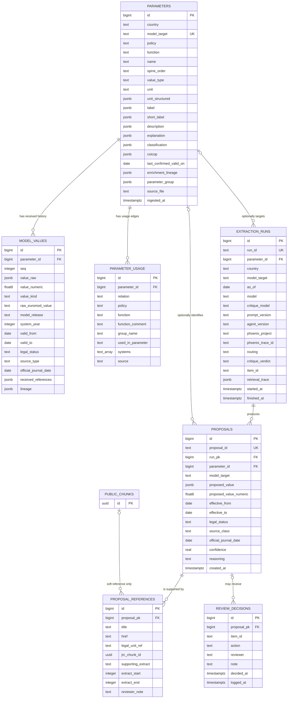
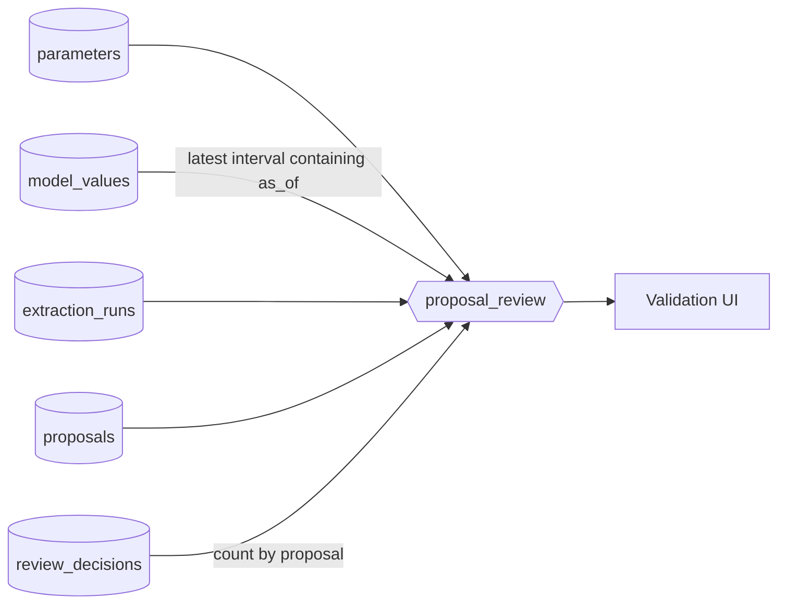

# Parameter Database Schema

This diagram documents the `params` schema created by
[`agentic-workflow/pipeline/db/params_schema.sql`](../agentic-workflow/pipeline/db/params_schema.sql).
It follows the four-stage ownership model: received EUROMOD data, deterministic
normalization, agent proposals, and append-only human review.

## Relationship Notes

- `parameters.model_target`, `extraction_runs.run_id`, and
  `proposals.proposal_id` are unique business identifiers.
- `model_values` is unique on `(parameter_id, seq)`; proposals never overwrite
  this received value history.
- `extraction_runs.parameter_id` and `proposals.parameter_id` are nullable so a
  run can represent a target that has not been ingested.
- `proposal_references.jrc_chunk_id` is deliberately not a foreign key. It is a
  soft reference to `public.chunks.id`; cited-chunk retention is enforced by
  `public.citation_registry`.
- `review_decisions` is append-only. A row must have either `proposal_pk` or
  `item_id`; `item_id` supports decisions on abstained or `not_found` queue
  items that have no proposal row.
- Phoenix trace IDs are also soft links because Phoenix data can be reset while
  proposal evidence remains durable.

## Review View

`params.proposal_review` is the validation UI read surface. It combines each
proposal with its run, parameter metadata, the model value applicable on the
run's `as_of` date, and a count of review decisions.

The view does not include `proposal_references`; evidence is loaded separately
from the proposal relationship when the reviewer opens citation details.