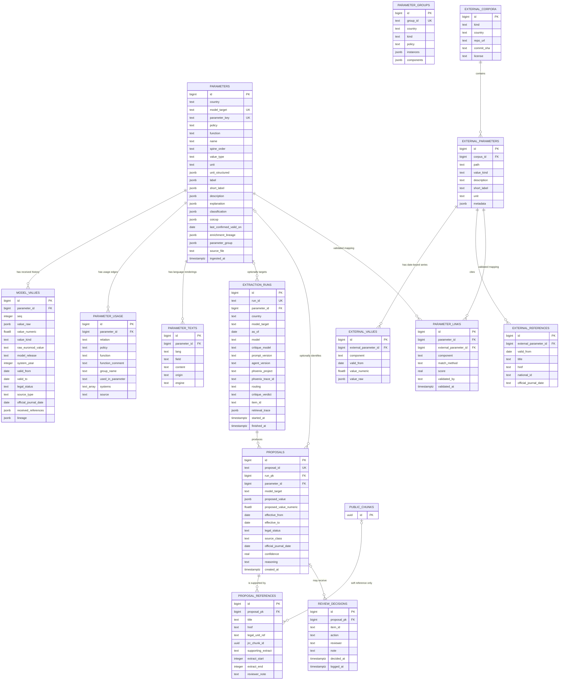
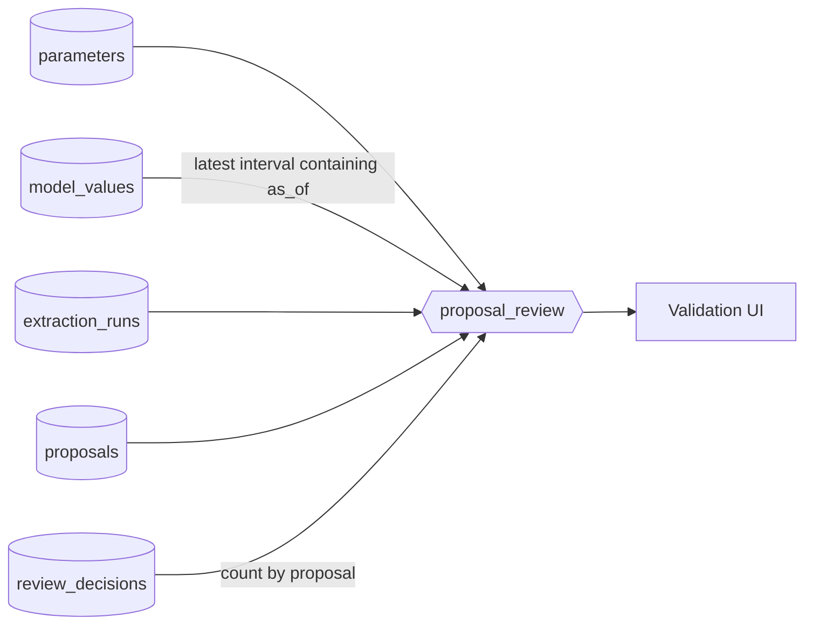

---
format:
  typst:
    grid:
      body-width: 6in
      margin-width: 0.4in
      gutter-width: 0.15in
---

# EUROMOD-Assisted Parameter Update Format

*Draft for discussion with the EUROMOD team.*

This document is a report for the EXPERT CONTRACT - CT-EX2026D1438052-101 for Deliverable 1: It provide expertise for the extraction of Policy Parameters for the Fiscal Models. The document specify the format of the policy parameters of the respective models.

## Introduction

### Why enrich EUROMOD parameters with legal references

A EUROMOD parameter today records *what* value the model uses, but not *why*. The consequences drive this whole proposal:

- **Updates cannot be verified without redoing the research.** When a new
  finance act changes a threshold, the person updating the model must locate
  the legal text from scratch; the previous update left no trail to start
  from.
- **Discrepancies stay invisible.** The model carries 11,496 where the cited
  law states 11,497 for the French income tax. Without a stored citation, nothing surfaces such a gap —
  it can only be found by accident.
- **Automation is impossible to trust.** An agent may propose values, but a
  proposal is only reviewable if it arrives with the exact supporting text and
  a resolvable citation. The anti-hallucination gate of this project —
  `supporting_extract` must occur character-for-character in the cited source
  — presupposes that references are first-class, structured data, not free
  text.
- **Temporal reasoning needs legal dates.** Model intervals (`valid_from` 1
  January, `valid_to` 31 December) are applicability conventions, not legal
  effective dates. Only a reference to the enacting text can establish when a
  value legally takes effect.

Enriching each parameter with structured legal references (source class,
legal status, official-journal date, article identifier, verbatim extract)
turns parameter maintenance from undocumented expert recall into a traceable,
reviewable, and partially automatable process.

### Why a database as the canonical store, with JSON export at the end

The enrichment could in principle live directly in JSON files passed between
tools. The proposal instead makes PostgreSQL the canonical store and JSON the
exchange format, produced by export at the end of the process, because the
work is inherently relational and multi-writer:

- **Several corpora must be joined.** The received EUROMOD export, the
  legislation chunks of the RAG database, the OpenFisca-France external
  corpus, agent proposals, and human decisions all reference one another
  (chunk ids, legislation identifiers, parameter links). These joins
  are one SQL query in a database and a fragile ad-hoc merge across files.
- **Ownership stages need enforcement, not convention.** Received data is
  read-only, normalization is additive, proposals never overwrite model
  history, and review decisions are append-only. Separate tables with
  constraints make these guarantees structural; a mutable JSON file makes them
  a promise.
- **Concurrent writers exist.** The ingestion, the agentic pipeline, the
  validation UI, and the evaluation pipeline all read and write the same
  state. A database gives them transactions and consistent views (e.g. the
  `params.proposal_review` view); shared JSON files give them race conditions.
- **Ingestion must be idempotent and re-runnable.** Re-ingesting a corrected
  export upserts on `model_target`; nothing accumulates or duplicates.
- **The received JSON is still preserved verbatim.** Language-keyed blocks,
  lineage, classification, and other received structures are stored unmodified
  in JSONB columns, so no information is lost between import and export.

Export-first remains the contract: at the end of the process, accepted
results are exported back to the JSON exchange format described in this
document (see [`parameter_sample.jsonc`](parameter_sample.jsonc)). Nothing
writes into EUROMOD files directly — the database is internal machinery, not a new interface
imposed on the team.

## 1. Purpose

The proof of concept assists a person updating EUROMOD parameters. For one existing parameter, it must:

1. receive the parameter and its history from the EUROMOD team;
2. select the relevant model value for a system year;
3. search authoritative sources for a candidate value;
4. show the candidate, exact supporting text, and citation;
5. let a person accept, reject, or request a revision.

The pipeline is **export-first and human-gated**. It never writes directly into EUROMOD.

The proposal is based on the files received from the EUROMOD team:

- `extracted_parameters/FR.policy.json` - the base parameter export;
- `extracted_parameters/enriched/FR.enriched.json` - the same export with enrichment.

Following a first review round, the team delivered an updated enriched export
(**schema_version 0.2.0**) that adopts the recommendations of the earlier
draft. This document describes the 0.2.0 format as received; where a field was
recommended in the draft and is now supplied upstream, this is noted
explicitly.



## 2. What is in the enriched French export (0.2.0)

The file was analysed with `jq`. It contains:

| Observation | Result |
|---|---:|
| Top-level shape | `{schema_version, country, parameters[], groups[]}` |
| `schema_version` | `0.2.0` |
| Parameter records | 702, each with `information` and `values` |
| Value-history rows | 3,886 |
| Unique `model_target` values | 702 |
| Exported target kind | 702 `def_const` constants |
| `value_type` | 702 `scalar` |
| Numeric value rows | 2,961 |
| Rows with `value: null` (raw value preserved) | 925, of which 758 `n/a` and 167 expressions |
| Parameters with `coicop` | 227 |
| Parameter-group definitions (`groups[]`) | 16 |
| `usage.defined_in` entries | 705 |
| `usage.used_by` entries | 5,368 |

Every `information` object contains:

```text
country, model_target, parameter_id, model_address, spine_order,
value_type, unit, structured_unit,
label, short_label, description, explanation,
last_confirmed_valid_on, classification, parameter_group,
usage, enrichment_lineage
```

`coicop` is additionally present for 227 consumption-tax parameters.

Every `values[]` row contains:

```text
value, valid_from, valid_to,
legal_status, source_type, official_journal_date,
references, lineage, normalized
```

Compared with the previous delivery, `parameter_id`, `model_address`,
`structured_unit`, `parameter_group`, the top-level `groups[]`, and the
per-value `normalized` block are new: they implement the deterministic
post-processing recommended in the first draft directly in the export. This
matches the needs of the assisted updater; the remaining task is to record who
supplies or fills each field.

## 3. Data ownership and processing stages

The proposed exchange record keeps the existing `information + values[]` envelope and adds proposal and review blocks. Comments in [`parameter_sample.jsonc`](parameter_sample.jsonc) use the same four labels as this section.

### Stage A - received from the EUROMOD team

For the POC, `FR.enriched.json` (0.2.0) is the received input contract. The POC treats its content as read-only source data.

The export contains:

- `country`, `model_target`, `parameter_id`, `spine_order`, `value_type`, and `unit`;
- `label`, `short_label`, `description`, `explanation`, and `classification`;
- `usage` and `enrichment_lineage` for all 702 parameters, `coicop` for 227;
- the complete `values[]` history with the raw EUROMOD representation
  (`lineage.model_answer`) and the source model identifier (`lineage.model`);
- since 0.2.0: `model_address`, `structured_unit`, `parameter_group`, the
  top-level `groups[]` definitions, and the per-value `normalized` block.

The POC must not ask the value-search agent to regenerate labels, descriptions, classification, COICOP, or usage information that has already been supplied.

### Stage B - deterministic post-processing

This stage performs small, explainable transformations. It does not use an LLM and does not invent policy facts.

Most of the Stage B derivations recommended in the first draft are now supplied
upstream in export 0.2.0 (`model_address`, `structured_unit`,
`normalized.model_release`, `normalized.system_year`,
`normalized.raw_euromod_value`, `parameter_group`). The ingestion therefore
treats them as received data; the local derivations remain implemented as a
fallback so that older exports and future countries without this enrichment
still load. Stage B additionally supplies, on the POC side:

- law-language renderings of labels and descriptions for retrieval
  (`parameter_texts`, see the external-corpora chapter, section 5);
- a simple arithmetic comparison between the current model value and a proposal.

The normalization rules remain intentionally modest:

1. Preserve the received fields for traceability.
2. `value: null` with `raw_euromod_value: "n/a"` means no normalized scalar is available. It never means zero.
3. Preserve formulas such as `$PSS * 4` or `0.6 * 6/12 + 0.4 * 6/12` as raw text. Formula parsing is not required.
4. Do not infer a legal effective date from a EUROMOD system year.
5. Do not silently correct questionable labels or units. Keep the received value and mark any normalized interpretation as post-processing.

### Stage C - agentic value search

The agent searches legislation or another permitted source and creates a new entry in `proposals[]`. It does not overwrite `values[]`.

The agent may supply:

- `proposed_value`;
- `effective_from` and `effective_to`, only when supported by the source;
- `source_class`;
- `legal_status`, when applicable;
- `official_journal_date`;
- one or more references;
- an exact `supporting_extract`;
- the cited RAG `chunks.id` as `jrc_database_id`;
- extraction lineage and confidence;
- a note explaining uncertainty or why the parameter should be routed to the national team.

The central anti-hallucination rule remains mechanical:

> For legislation-sourced proposals, `supporting_extract` must occur character-for-character in the cited RAG chunk before the proposal can be accepted.

The agent is allowed to say that it cannot determine the value. It must not manufacture a citation or explain a model/legal difference without evidence.

### Stage D - human review

The validation UI appends entries to `review_decisions[]`:

```text
accepted | rejected | needs_revision
```

A decision records the proposal id, reviewer, timestamp, and note. Previous decisions are retained. An empty list means that the proposal is pending.



## 4. Keep the existing parameter identity

The received export uses:

```text
euromod://FR/tinkt_fr/def_const/$tin_upthres1
```

`model_target` remains the canonical compatibility identifier. Since export
0.2.0, the received `model_address` field exposes its parts:

```json
{
  "policy": "tinkt_fr",
  "function": "def_const",
  "kind": "constant",
  "name": "$tin_upthres1"
}
```

A compact received identifier, `parameter_id`
(`FR:tinkt_fr:def_const:$tin_upthres1`), accompanies it and is used by the
group definitions. The team should confirm that these components are correct
and sufficient for eventual write-back.

## 5. Keep model history separate from proposals

The received `values[]` rows describe the values found in the exported model. For `$tin_upthres1`, the enriched file contains:

| Model year derived from `valid_from` | Received value | Raw EUROMOD value |
|---:|---:|---|
| 2023 | 10,777 | `10777#y` |
| 2024 | 11,294 | `11294#y` |
| 2025 | 11,496 | `11496#y` |

The cited version of CGI article 197 states `11 497 EUR`. The POC should display both facts:

- **existing model value:** 11,496 for the 2025 system in release J2.19;
- **agent proposal:** 11,497, supported by the cited legal extract.

The agent must not replace the existing history. The reviewer decides whether a model update is appropriate and may ask the national team why the values differ.

### Model release and system year

The received lineage contains:

```text
euromod-connector:EUROMOD_MASTER_VERSION_J2.19
```

Since 0.2.0 the export supplies `normalized.model_release: "J2.19"` and `normalized.system_year` directly; for the latest annual row, `system_year: 2025` corresponds to the interval beginning at `valid_from: "2025-01-01"`.

Some received rows cover several years. In that case `valid_from` and `valid_to` remain the model interval, while `system_year` is the particular year being reviewed within that interval. It must not always be treated as a rename of the `valid_from` year.

Both are useful because a later release may revise the same system year. The original `valid_from`, `valid_to`, and lineage fields remain available until the EUROMOD team confirms that these derivations are reliable across countries.

### Model dates versus legal dates

All 3,886 received `valid_from` dates are 1 January, and every non-null `valid_to` is 31 December. For this POC, these dates are treated as model applicability intervals.

Legal dates belong in the proposal as `effective_from` and `effective_to`. They are filled only when the source establishes them. A legal date may therefore remain `null` even when the system year is known.

## 6. Values and units

### Literal, unavailable, and expression values

Since export 0.2.0 this normalization is applied upstream: `value` carries the
normalized scalar or `null`, and `normalized.raw_euromod_value` retains the
exact EUROMOD representation:

| Raw EUROMOD value | Received `value` | `normalized.raw_euromod_value` |
|---|---|---|
| `11496#y` | `11496` | `"11496#y"` |
| `n/a` | `null` | `"n/a"` |
| `$PSS * 4` | `null` | `"$PSS * 4"` |
| weighted expression | `null` | complete expression |

`null` means “no normalized scalar is available”; it does not mean zero. Expressions remain visible to the reviewer, but the POC does not evaluate them. In the database, `model_values.value_kind` distinguishes `numeric`, `n_a`, and `expression` rows (2,961 / 758 / 167 for France).

### Units

The received `structured_unit` field complements the received `unit`:

```json
{
  "quantity": "money",
  "currency": "EUR",
  "period": "year",
  "euromod_suffix": "#y"
}
```

This structured unit is a convenience view. It is not allowed to hide the original value because the French data still contains questionable combinations, such as rates labelled `currency`.

## 7. Optional parameter groups

The received export correctly stores schedule components as separate scalar constants:

```text
$tin_upthres1 ... $tin_upthres5
$tin_rate1 ... $tin_rate6
```

The POC keeps every constant and `model_target` unchanged. Since export 0.2.0
the groups are received data: 16 group definitions arrive in the top-level
`groups[]` array, each listing its components by `parameter_id` with a role
and band index:

```json
{
  "id": "FR:tinkt_fr:tin_schedule",
  "kind": "bracket_schedule",
  "policy": "tinkt_fr",
  "components": [
    { "parameter_id": "FR:tinkt_fr:def_const:$tin_rate1",     "role": "rate",            "band_index": 1 },
    { "parameter_id": "FR:tinkt_fr:def_const:$tin_upthres1",  "role": "upper_threshold", "band_index": 1 }
  ]
}
```

A per-parameter `parameter_group` hint mirrors the membership on 265 parameter
records. This is a display and retrieval hint only: it does not combine values
into an array and does not change write-back.

## 8. Source class, legal status, and references

`source_class` answers “where did this candidate value come from?”:

```text
legislation | administrative_guidance | official_statistics | national_team | other
```

`legal_status` answers “what is the lifecycle state of this legal measure?”:

```text
enacted_in_force | enacted_not_yet_in_force | bill_proposed | announced
```

`legal_status` may be `null` for official statistics or national-team values. `national_team` is a source class, not a legal lifecycle status.

For legislation, references attach to the proposal that they support, not to the parameter in general. A reference may include title, article, URL, legal-unit identifier, exact extract, RAG chunk id, and offsets.



## 9. Usage and file size

The received `usage` block is valuable context: it shows where a constant is defined and its 5,368 uses in the model. It should not be discarded.

For the POC there are two acceptable options:

1. keep `usage` in each full exchange record, matching `FR.enriched.json`; or
2. place the unchanged usage graph in a sidecar file or table and keep a `usage_ref` in the compact review record.

Option 2 reduces repeated data sent to the agent and UI. It is an optimization, not a change to the information supplied by the EUROMOD team.

## 10. Minimal POC storage

PostgreSQL remains the proposed canonical store; JSON remains the exchange format.

The minimum tables are:

- `parameters` - received information plus deterministic normalized fields;
- `model_values` - received model history and raw EUROMOD representations;
- `parameter_usage` - received usage graph, optionally stored separately;
- `parameter_groups` - received group definitions from `groups[]`;
- `parameter_texts` - derived law-language renderings of labels and descriptions;
- `proposals` - agent-generated candidate values and source metadata;
- `proposal_references` - evidence attached to proposals;
- `extraction_runs` - agent, model, prompt, confidence, and retrieval trace;
- `review_decisions` - append-only human decisions.

The external-corpora chapter adds `external_corpora`, `external_parameters`,
`external_values`, `external_references`, and `parameter_links` for curated
sources such as OpenFisca-France.

This is intentionally smaller than a general fiscal-parameter database.

This schema is implemented as the `params` schema of the shared legislation
database: [Nomoscope-agentic-workflow/pipeline/db/params_schema.sql](../Nomoscope-agentic-workflow/pipeline/db/params_schema.sql)
(`references` is a reserved SQL word, so that table is named
`proposal_references`). It is applied and populated with:

```bash
cd Nomoscope-agentic-workflow/pipeline
uv run nomoscope-workflow init-param-db
uv run nomoscope-workflow ingest-params ../../extracted_parameters/enriched/FR.enriched.json
```

Each `extraction_runs` row additionally carries `phoenix_trace_id`, the
OpenTelemetry trace id of that run's root span. A reviewer can open the full
agent process (frame, retrieve, propose, critique, diff) in Arize Phoenix at
`http://localhost:6006/projects/<project-id>/traces/<phoenix_trace_id>`.
This is a soft link for process transparency: the durable evidence remains the
verbatim `supporting_extract` and chunk id on `proposal_references`. The
`params.proposal_review` view joins a proposal, its current model value, and
the trace id as the read surface for the validation UI.

## 11. Required fields and gates

### Required POC input

- received `information.model_target` and `information.country`;
- received `values[]` history;
- received raw model value and connector/model identifier;
- enough received metadata to display the parameter to a reviewer.

### Required agent proposal

- `proposal_id`;
- `proposed_value`, which may be `null` when the agent abstains;
- `source_class`;
- run id and confidence;
- legal dates only when supported by evidence.

### Required before acceptance

- `legal_status` for legislation;
- at least one citation and exact supporting extract for legislation;
- otherwise, an appropriate source reference or explicit national-team note.

`parameter_group`, structured units, offsets, and legal end dates are optional.

## 12. Validation exercise

Validate 5-10 records already present in `FR.enriched.json`:

- one plain statutory amount;
- one rate;
- one `"n/a"` value;
- one raw expression;
- the `$tin_upthres1` model/legal discrepancy;
- optionally, two members of a validated parameter group;
- one parameter routed to the national team.



## Parameter Database Schema

This diagram documents the `params` schema created by
[`Nomoscope-agentic-workflow/pipeline/db/params_schema.sql`](../Nomoscope-agentic-workflow/pipeline/db/params_schema.sql).
It follows the four-stage ownership model: received EUROMOD data, deterministic
normalization, agent proposals, and append-only human review.

:::{.column-page}



:::

## Relationship Notes

- `parameters.model_target`, `parameters.parameter_key`,
  `extraction_runs.run_id`, and `proposals.proposal_id` are unique business
  identifiers.
- `model_values` is unique on `(parameter_id, seq)`; proposals never overwrite
  this received value history.
- `parameter_groups.components` reference parameters by their received
  `parameter_key`; membership is a hint, not a foreign-key constraint.
- `parameter_texts` is unique on `(parameter_id, lang, field, origin)`. The
  received language-keyed jsonb on `parameters` is never modified; derived
  renderings live here with provenance (`machine_translation`, `openfisca`,
  or `manual`).
- `extraction_runs.parameter_id` and `proposals.parameter_id` are nullable so a
  run can represent a target that has not been ingested.
- `proposal_references.jrc_chunk_id` is deliberately not a foreign key. It is a
  soft reference to `public.chunks.id`; cited-chunk retention is enforced by
  `public.citation_registry`.
- `review_decisions` is append-only. A row must have either `proposal_pk` or
  `item_id`; `item_id` supports decisions on abstained or `not_found` queue
  items that have no proposal row.
- Phoenix trace IDs are also soft links because Phoenix data can be reset while
  proposal evidence remains durable.
- The `external_*` tables carry no EUROMOD identity: a corpus loads without any
  mapping. `parameter_links` is the only bridge, is initially empty, and a row
  counts as validated only once `validated_by` is set.



## Review View

`params.proposal_review` is the validation UI read surface. It combines each
proposal with its run, parameter metadata, the model value applicable on the
run's `as_of` date, and a count of review decisions.

:::{.column-page}



:::

The view does not include `proposal_references`; evidence is loaded separately
from the proposal relationship when the reviewer opens citation details.



## Using External Parameter Corpora in the Assisted-Update Pipeline

This chapter focuses on OpenFisca-France, but the storage and matching design
is generic and accommodates other curated sources that may be identified
later.

### 1. What OpenFisca-France offers

OpenFisca-France maintains a human-curated database of French tax-benefit
parameters as YAML files (`openfisca_france/parameters/**.yaml`): **4,012
parameter files, ~2,500 of them carrying legal references**. One file, e.g.
`impot_revenu/bareme_ir_depuis_1945/bareme.yaml`, contains:

- the full value history (the income-tax scale back to 1945), as date-keyed
  scalars or bracket structures;
- per-date `metadata.reference` entries: `{title: "Loi 63-1241 du 19/12/1963
  (LF pour 1964)", href: "https://www.legifrance.gouv.fr/...JORFTEXT000000875392"}`;
- per-date `official_journal_date`;
- `description` and `short_label` written in the law's own language (French),
  sometimes an English label;
- units (`rate_unit`, `threshold_unit`) and curated historical notes.

Two properties make this directly useful:

1. **The reference hrefs embed `LEGIARTI`/`JORFTEXT` identifiers** — the same
   national ids the legislation database keys on (`legal_units.national_id`)
   and that the retrieval citation fast path matches directly.
2. **The file format is defined by openfisca-core, not by the France
   package.** Every OpenFisca country package (and the PolicyEngine forks for
   UK/US/CA) uses the same `values:/brackets:/metadata:` layout. A single
   ingester covers all of them.

Coverage varies by pilot member state: France is excellent; Spain and Belgium
packages exist but are thinner; Ireland and Lithuania have none. OpenFisca is
therefore an **optional per-country enrichment, never a dependency** — the
same philosophy as the ingest country adapters.

### 2. Storage: ingest first, match later

The key design decision: **storage does not require a mapping to EUROMOD.**
The corpus is ingested under its own identity (its dotted path, e.g.
`impot_revenu.bareme_ir_depuis_1945.bareme`); linking to EUROMOD parameters is
a separate, sparse, later step. The following tables are implemented in the
`params` schema:

- `external_corpora` — one row per source:
  `(kind='openfisca', country, repo_url, commit, license)`. Pinning the git
  commit keeps every downstream use reproducible, like the eval golden set.
- `external_parameters` — `(corpus_id, path, description, short_label, unit,
  metadata jsonb)`, keyed by the corpus-native path.
- `external_values` — the date-keyed history, one row per
  `(external_parameter_id, valid_from)`, with scalar and bracket forms.
- `external_references` — per-date `{title, href, national_id, official_journal_date}`,
  with the `LEGIARTI`/`JORFTEXT` id parsed out of the href at ingest time.
- `parameter_links` — the EUROMOD mapping, **initially empty**:
  `(parameter_id → params.parameters, external_parameter_id, match_method,
  score, validated_by, validated_at)`.

An unmatched external parameter is the normal state, not an error. The corpus
is useful even before any link exists (e.g. as a browsable reference in the
UI, and as a source of native-language vocabulary).

### 3. The matching problem

There is **no shared key** between `euromod://FR/tinkt_fr/def_const/$tin_upthres1`
and `impot_revenu.bareme_ir_depuis_1945.bareme`. Names, granularity and
structure all differ (EUROMOD stores the scale as ten separate scalar
constants; OpenFisca stores one bracket object). Any automated matching can
only produce **suggestions**; a human validates them in the UI, exactly like
the `parameter_group` mappings in the format proposal. `match_method` and
`score` are recorded so a bad heuristic can be rolled back wholesale.

Candidate signals, in order of trustworthiness:

1. **Value-fingerprint matching (deterministic, strongest).** Both sides hold
   multi-year numeric histories. `$tin_upthres1` = 10,777 / 11,294 / 11,496
   for 2023/2024/2025; the OpenFisca scale's second threshold holds nearly the
   same series. Matching = same value in a majority of overlapping years,
   within a tolerance — *not* exact equality, because the divergences are
   precisely what the pipeline exists to surface (EUROMOD has 11,496 where the
   law says 11,497). A ≥3-year fingerprint match is close to conclusive; the
   same signal generalises to any country with no language dependence.

   The ingested data confirms this and adds one requirement. The OpenFisca
   series for that threshold is 10,777 / 11,294 / 11,497 / 11,600 dated
   2022/2023/2024/2025: OpenFisca dates income-tax parameters by **income
   year** while EUROMOD dates them by **system year**, so the matcher must
   tolerate a ±1-year date offset per corpus. The comparison also shows the
   corpus's value as corroboration: OpenFisca carries 11,497 (the legal value)
   where the model carries 11,496, and already holds 11,600 from the 2026
   finance act — a pending update the assisted pipeline should surface.
2. **Structural compatibility (deterministic filter).** Units must be
   compatible (`/1` rate ↔ `rate_unit: /1`; currency/year ↔
   `currency_next_year`), bracket-group shape must fit (5 thresholds + 6 rates
   ↔ a 5-bracket scale), COICOP codes narrow consumption-tax parameters.
3. **Multilingual embedding similarity** between EUROMOD descriptions and
   OpenFisca descriptions (BGE-M3 is already in the stack and is
   cross-lingual, so English EUROMOD text scores against French OpenFisca text
   without translation). Good for ranking candidates, not for deciding.
4. **LLM adjudication of the top-k candidates** produced by 1–3, with the
   verdict stored as a suggestion (`match_method='llm_suggested'`), never
   auto-validated.

Realistic expectation: fingerprints + structure alone should link the
high-value numeric parameters (schedules, thresholds, rates with several years
of history); text similarity mops up part of the rest; a tail stays unmatched
and that is acceptable.

### 4. What a validated link buys the pipeline

1. **Retrieval hints — the biggest win.** Today `frame` derives citations from
   previous `values[].references`, which are empty in the whole FR export. A
   linked parameter contributes the OpenFisca reference titles and parsed
   `LEGIARTI`/`JORFTEXT` ids for dates near `as_of` to the citation fast path,
   and tells `nomotheca-ingest` exactly which instruments to fetch on a cache
   miss. This attacks the hardest problem — *finding the right article* — with
   human-curated pointers.
2. **Cross-validation in critique — corroboration, never evidence.** A
   deterministic check compares the proposal against the linked OpenFisca
   value at `as_of`: agreement is noted on the critique report; disagreement
   becomes an issue for the reviewer ("OpenFisca has 11,497 from 2025-01-01").
   The verbatim-extract anti-hallucination rule is untouched: OpenFisca is a
   curated *secondary* source and can never serve as the `supporting_extract`
   for a legislation-sourced proposal. (`Lineage.proposed_by` already includes
   `"openfisca"` for values that originate there.)
3. **Golden-set expansion for the evaluation dataset.** Per-date values + official-journal
   dates + citations are human-curated `(value, effective date, reference)`
   triples — candidate `expected` blocks for eval cases, generated cheaply and
   confirmed by a human.
4. **Native-language parameter text for free.** OpenFisca descriptions are
   human-written in the law's language — better than any machine translation
   for the search problem below.

### 5. Native-language search text

The enriched EUROMOD export carries English-only labels and descriptions,
while the legislation chunks are indexed with language-specific FTS (`fts_fr`
for France). The vector leg of hybrid retrieval is multilingual (BGE-M3), but
the full-text leg was effectively crippled cross-language.

Implemented in the workflow package:

- `params.parameter_texts` stores derived renderings of `label` /
  `short_label` / `description` per language, with provenance
  (`origin: machine_translation | openfisca | manual`, plus the engine used).
  Received Stage A jsonb fields stay untouched — translations are Stage B
  enrichment, marked as such.
- `nomoscope-workflow translate-params` machine-translates the English texts
  into the law language (batched, provider-agnostic via the shared `llm.py`).
- `frame` prefers the law-language text when present for the retrieval query,
  keeping the received text as a secondary signal. No translation, no DB —
  behaviour is unchanged.

Where a validated OpenFisca link exists, its human-written description should
replace the machine translation (`origin='openfisca'` wins over
`origin='machine_translation'`).

For France, all 702 parameters have been translated: 702 French descriptions
and 575 French labels (labels that are bare parameter codes are skipped, as a
copy carries no cross-language signal).

### 6. Caveats

- **License:** openfisca-france is AGPL-3.0. Using the data as a reference
  input and storing derived rows is fine for the prototype; flag it in the
  contract documentation before any redistribution.
- **OpenFisca is not the law.** It is curated and occasionally wrong or
  lagging; that is why it corroborates but never evidences.
- **Mappings decay.** Both sides evolve; `parameter_links` carries the corpus
  commit so a re-ingest can flag links whose external side changed.
- OpenFisca-France dates by income year : the last fiscal law for France is from 2026-02-20 but OpenFisca model says it apply from 2025-01-01 as it is for the income of 2025.



## APPENDIX

### JSONC for parameter storage sample

```jsonc
{
  // Version of this exchange format.
  "schema_version": "0.2.0",

  // The existing `information` block is retained from FR.enriched.json.
  "information": {
    // [RECEIVED] ISO country code.
    "country": "FR",

    // [RECEIVED] Existing stable address used by the EUROMOD export.
    "model_target": "euromod://FR/tinkt_fr/def_const/$tin_upthres1",

    // [RECEIVED] Ordering information from the EUROMOD spine.
    "spine_order": "28",

    // [RECEIVED] All 702 current French records are exported as scalar.
    "value_type": "scalar",

    // [RECEIVED] Unit after the existing EUROMOD-side enrichment.
    // The raw field is preserved even when post-processing adds a structured view.
    "unit": "currency/year",

    // [RECEIVED] Existing English label.
    "label": {
      "en": "Upper limit for band1"
    },

    // [RECEIVED - EXISTING ENRICHMENT]
    // FR.enriched.json fills the short label for this parameter.
    "short_label": {
      "en": "$tin_upthres1"
    },

    // [RECEIVED - EXISTING ENRICHMENT]
    // This context already exists and should not be regenerated by the value-search agent.
    "description": {
      "en": "Upper income threshold of the first (0%) band of the progressive personal income tax schedule, set at 11 496 EUR for 2025 taxable income (Table 2.77, top of the 0% bracket). It is used as the Band_UpLim parameter in the tin_fr SchedCalc \"Gross income tax (before any IMAX corrections)\" and in tinkt_fr's \"Imax: New gross tax using new QF\" recalculation, defining where the 0% band ends and the next taxed band ($tin_rate3) begins."
    },

    // [RECEIVED] Existing function-group explanation.
    "explanation": {
      "en": "EUROMOD function group: Paramteres of the income tax"
    },

    // [RECEIVED] Currently null for all 702 French parameters.
    // A successful review may update this later; the value-search agent does not invent it.
    "last_confirmed_valid_on": null,

    // [RECEIVED] Existing classification from the prior Haiku classification pass.
    "classification": {
      "category": "policy",
      "confidence": 0.95,
      "reason": "Income tax threshold for band 1",
      "classifier": "haiku"
    },

    // [RECEIVED - EXISTING ENRICHMENT]
    // Describes how the parameter description/context was enriched before this POC.
    "enrichment_lineage": {
      "model": "sonnet",
      "sources_used": [
        "theme:taxes.md",
        "cr:99-111"
      ],
      "confidence": 0.85,
      "status": "pending"
    },

    // [RECEIVED] Parsed deterministically from model_target. The original URI remains above.
    "model_address": {
      "policy": "tinkt_fr",
      "function": "def_const",
      "kind": "constant",
      "name": "$tin_upthres1"
    },

    // [RECEIVED]
    // Convenience view of the received unit and the suffix in the raw EUROMOD value.
    // It must not overwrite the received unit if the interpretation is uncertain.
    "structured_unit": {
      "quantity": "money",
      "currency": "EUR",
      "period": "year",
      "euromod_suffix": "#y"
    },

    // [RECEIVED]
    // This scalar remains independently addressable. The group only helps the UI
    // show that $tin_upthres* and $tin_rate* form related schedule components.
    // The mapping must be validated by the EUROMOD team.
    "parameter_group": {
      "id": "FR:tinkt_fr:income_tax_schedule",
      "kind": "bracket_schedule",
      "role": "upper_threshold",
      "index": 1
    },

  },

  // [RECEIVED + POST-PROCESSING]
  // `values` remains the existing EUROMOD model history. The real record contains
  // earlier years too; only 2023-2025 are shown here to keep the example readable.
  "values": [
    {
      // [RECEIVED] Usable value exported for this model interval.
      "value": 10777,
      // [RECEIVED] Model applicability interval, not necessarily a legal interval.
      "valid_from": "2023-01-01",
      "valid_to": "2023-12-31",
      // [RECEIVED PLACEHOLDERS] Empty in every current French value row.
      "legal_status": null,
      "source_type": null,
      "official_journal_date": null,
      "references": [],
      "lineage": {
        "proposed_by": "pipeline",
        "run_id": null,
        "prompt_version": null,
        "agent_version": null,
        // [RECEIVED] Identifies the connector and EUROMOD master release.
        "model": "euromod-connector:EUROMOD_MASTER_VERSION_J2.19",
        // [RECEIVED] Exact EUROMOD representation; renamed below for clarity.
        "model_answer": "10777#y",
        "reviewed_by": null,
        "review_status": "pending",
        "reviewed_at": null,
        "review_note": null,
        "confidence": null,
        "retrieval_trace": null
      },
      "normalized": {
        "model_release": "J2.19",
        // Selected system year for this annual interval. For compressed multi-year
        // intervals, the workflow selects a year inside valid_from/valid_to.
        "system_year": 2023,
        "value": 10777,
        "raw_euromod_value": "10777#y"
      }
    },
    {
      "value": 11294,
      "valid_from": "2024-01-01",
      "valid_to": "2024-12-31",
      "legal_status": null,
      "source_type": null,
      "official_journal_date": null,
      "references": [],
      "lineage": {
        "proposed_by": "pipeline",
        "run_id": null,
        "prompt_version": null,
        "agent_version": null,
        "model": "euromod-connector:EUROMOD_MASTER_VERSION_J2.19",
        "model_answer": "11294#y",
        "reviewed_by": null,
        "review_status": "pending",
        "reviewed_at": null,
        "review_note": null,
        "confidence": null,
        "retrieval_trace": null
      },
      "normalized": {
        "model_release": "J2.19",
        "system_year": 2024,
        "value": 11294,
        "raw_euromod_value": "11294#y"
      }
    },
    {
      "value": 11496,
      "valid_from": "2025-01-01",
      "valid_to": null,
      "legal_status": null,
      "source_type": null,
      "official_journal_date": null,
      "references": [],
      "lineage": {
        "proposed_by": "pipeline",
        "run_id": null,
        "prompt_version": null,
        "agent_version": null,
        "model": "euromod-connector:EUROMOD_MASTER_VERSION_J2.19",
        "model_answer": "11496#y",
        "reviewed_by": null,
        "review_status": "pending",
        "reviewed_at": null,
        "review_note": null,
        "confidence": null,
        "retrieval_trace": null
      },
      "normalized": {
        "model_release": "J2.19",
        "system_year": 2025,
        "value": 11496,
        "raw_euromod_value": "11496#y"
      }
    }
  ],

  // [AGENTIC SEARCH]
  // Proposals are new records. They never overwrite the received model history.
  "proposals": [
    {
      // Mandatory stable id used by review decisions.
      "proposal_id": "proposal-fr-tin-upthres1-2025-001",

      // Candidate value found in the cited version of CGI article 197.
      "proposed_value": 11497,

      // Legal dates are filled only when the source establishes the mapping.
      // The EUROMOD system year alone is not evidence of a legal effective date.
      "effective_from": null,
      "effective_to": null,

      // Origin of the candidate value, independent from the law's lifecycle.
      "source_class": "legislation",
      "legal_status": "enacted_in_force",
      "official_journal_date": "2025-02-15",

      // One proposal can be supported by several references.
      "references": [
        {
          "title": "Code général des impôts, article 197",
          "href": "https://www.legifrance.gouv.fr/codes/article_lc/LEGIARTI000046860759/2025-02-16/",
          "legal_unit_ref": "LEGIARTI000046860759",

          // Must occur verbatim in the cited RAG chunk before acceptance.
          "supporting_extract": "L'impôt est calculé en appliquant à la fraction de chaque part de revenu qui excède 11 497 € le taux de :",

          // Filled after retrieval from the legislation database.
          "jrc_database_id": null,
          "extract_offsets": null
        }
      ],

      // Technical trace of the agentic value-search run.
      "lineage": {
        "proposed_by": "pipeline",
        "run_id": "2026-07-15T09:12Z#fr-tin-upthres1",
        "prompt_version": "0.2.0",
        "agent_version": "0.2.0",
        "model": "provider/model-name",
        "confidence": 0.95,
        "retrieval_trace": null
      },

      // [POST-PROCESSING]
      // Arithmetic comparison only. It does not explain why the values differ.
      "comparison": {
        "model_release": "J2.19",
        "system_year": 2025,
        "model_value": 11496,
        "proposed_value": 11497,
        "difference": 1,
        "status": "requires_review"
      }
    }
  ],

  // [HUMAN REVIEW]
  // Append-only. An empty array means that the proposal is pending.
  "review_decisions": [
    {
      "proposal_id": "proposal-fr-tin-upthres1-2025-001",
      "decision": "needs_revision",
      "reviewed_by": "reviewer-id",
      "reviewed_at": "2026-07-20T10:15:00Z",
      "note": "Confirm with the national team why J2.19 contains 11496 before accepting 11497."
    }
  ]
}

/*
Additional normalization examples from the received French file
----------------------------------------------------------------

1. EUROMOD `n/a`

Received:
{
  "value": "n/a",
  "lineage": { "model_answer": "n/a" }
}

Post-processing view:
{
  "value": null,
  "raw_euromod_value": "n/a"
}

`null` means that no normalized scalar is available. It never means zero.

2. EUROMOD expression

Received:
{
  "value": "$PSS * 4",
  "lineage": { "model_answer": "$PSS * 4" }
}

Post-processing view:
{
  "value": null,
  "raw_euromod_value": "$PSS * 4"
}

The POC preserves the expression for the reviewer but does not require a formula
parser, dependency graph, or evaluated result.
*/
```



### How to run the parameter pipeline

Please refer to Nomoscope-agentic-workflow/README.md for an up-to-date version.

All commands below were executed against the French data and produce the
figures quoted in this report. The pipeline lives in
`Nomoscope-agentic-workflow/pipeline`; commands run from that directory with `uv run`.

#### Prerequisites

1. **The database stack**, from the repository root:

   ```bash
   docker compose up -d
   ```

   This starts PostgreSQL (host port 5434, with the legislation schema),
   pgAdmin (port 5050), and Arize Phoenix for agent-trace observability
   (port 6006).

2. **LLM credentials** in `.env` at the repository root or in
   `Nomoscope-agentic-workflow/.env`. Models are provider-prefixed strings
   (`anthropic/…`, `openai/…`, `azure_openai/…`, `openrouter/…`); set
   `WORKFLOW_MODEL` accordingly. The special `mock/extractor` model runs the
   whole workflow without credentials for demonstration, but the translation
   step requires a real model.

#### Step 1 - Create the parameter store

```bash
uv run nomoscope-workflow init-param-db
```

Applies `db/params_schema.sql` idempotently: the `params` schema described in
the database chapter is created (or migrated additively) inside the existing
legislation database.

#### Step 2 - Ingest the EUROMOD export

```bash
uv run nomoscope-workflow ingest-params ../../extracted_parameters/enriched/FR.enriched.json
# FR.enriched.json: 702 parameters, 3886 model values, 6073 usage edges
```

Loads `parameters`, `model_values`, `parameter_usage`, and `parameter_groups`.
Both export envelopes are accepted (the earlier bare record list and the 0.2.0
object); received Stage B fields take precedence over local derivations.
Re-ingesting the same country is idempotent: parameters upsert on
`model_target`, value and usage rows are replaced.

#### Step 3 - Ingest the OpenFisca corpus

```bash
uv run nomoscope-workflow ingest-openfisca ~/Euromod/openfisca-france/openfisca_france/parameters --country FR
# 2836 external parameters, 19391 value points, 16788 references
```

Walks the YAML tree of an OpenFisca-format country package into the
`external_*` tables, pinning the git commit for reproducibility. Bracket
scales are flattened to one time series per band component — the grain used
for value-fingerprint matching. 9,994 of the 16,788 references carry a parsed
national identifier (`LEGIARTI`/`JORFTEXT`), directly usable by the retrieval
citation fast path.

After this step both corpora are in the database under their own identities.
**No links between EUROMOD and OpenFisca parameters exist yet**: populating
and validating `parameter_links` is the matching step described in the
external-corpora chapter, planned for the next phase.

#### Step 4 - Translate parameter texts into the law language

```bash
uv run nomoscope-workflow translate-params --country FR
# 702 French descriptions, 575 French labels in params.parameter_texts
```

Machine-translates the English labels and descriptions into the country's law
language (batched, resumable — already-translated parameters are skipped;
`--force` re-translates). The workflow's retrieval query then prefers these
renderings automatically.

#### Current state after this procedure (France)

| Store | Content |
|---|---:|
| `params.parameters` / `model_values` / `parameter_usage` | 702 / 3,886 / 6,073 |
| `params.parameter_groups` | 16 |
| `params.parameter_texts` (French, machine-translated) | 1,277 |
| `params.external_parameters` (OpenFisca-France) | 2,836 |
| `params.external_values` / `external_references` | 19,391 / 16,788 |
| `params.parameter_links` | 0 (matching is the next phase) |
