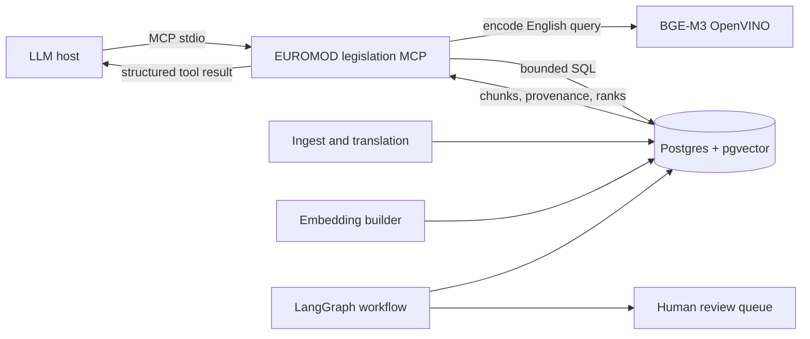

# MCP architecture

The MCP server is a read-only access adapter over the existing legislation
database. It does not create another corpus, vector store, or ingestion path.

## Responsibilities

The server owns query-time concerns:

- lazy query encoding with the same BGE-M3 model used for stored vectors;
- country, point-in-time, and language candidate filters;
- full-text, vector, or reciprocal-rank-fused hybrid ranking;
- deduplication of language renderings by legal version and chunk sequence;
- transparent full-text rank, vector distance, and score contributions;
- exact chunk lookup by `chunks.id`.

Existing components keep their responsibilities:

- `RAG/ingest` fetches, versions, translates, chunks, and embeds legislation;
- Postgres remains the single source of truth and vector store;
- `agentic-workflow/pipeline` remains the controlled update workflow;
- the validation UI remains the human approval boundary.

## Trust boundary

The MCP server exposes no arbitrary SQL and opens sessions with
`default_transaction_read_only=on` plus a statement timeout. Tool inputs are
bound SQL parameters. MCP results are evidence supplied to a model, not accepted
parameter updates. Any workflow proposal must still cite a returned chunk and
pass the existing character-for-character supporting-extract verification.

## Architecture impact

This adds an access layer, not a new data or decision layer. It makes the RAG
retriever reusable by MCP-capable hosts and shifts query embedding into the
long-lived MCP process. Deployment therefore gains one local process and model
memory allocation, while ingestion, database schema, workflow state machine,
and human-gated export remain unchanged.
