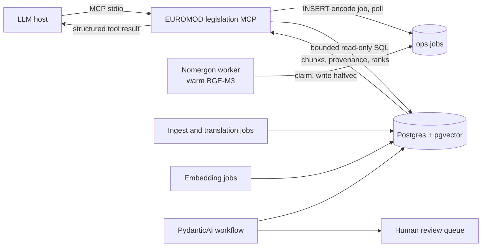

# MCP architecture

The MCP server is an access adapter over the existing legislation database. It
does not create another corpus, vector store, ingestion path, or model process.

## Responsibilities

The server owns query-time concerns:

- obtaining a query vector from the worker's `encode` lane (`ops.jobs`, priority
  100, 100 ms poll, `EUROMOD_ENCODE_TIMEOUT`), with a liveness check on
  `ops.workers.heartbeat_at` so a missing worker is a clear error, not a hang;
- country, point-in-time, and language candidate filters;
- full-text, vector, or reciprocal-rank-fused hybrid ranking;
- deduplication of language renderings by legal version and chunk sequence;
- transparent full-text rank, vector distance, and score contributions;
- exact chunk lookup by `chunks.id`.

Existing components keep their responsibilities:

- `Nomergon-worker` is the only process that loads BGE-M3 or holds a model
  credential (ADR 0004);
- `Nomotheca-RAG/ingest` fetches, versions, translates, chunks, and embeds legislation;
- Postgres remains the single source of truth, vector store, and job bus;
- `Nomoscope-agentic-workflow/pipeline` remains the controlled update workflow;
- the validation UI remains the human approval boundary.

## Trust boundary

The MCP server exposes no arbitrary SQL. Search and chunk lookup use a session
with `default_transaction_read_only=on` plus a statement timeout; job
submission uses a second autocommit session under the same analyst login, whose
role (`nomos_reviewer`) may insert `ops.jobs` rows and cancel its own, nothing
else (row-level security in `Nomergon-worker/db/roles.sql`). Tool inputs are
bound SQL parameters. MCP results are evidence supplied to a model, not accepted
parameter updates. Any workflow proposal must still cite a returned chunk and
pass the existing character-for-character supporting-extract verification.

## Architecture impact

This adds an access layer, not a new data or decision layer. It makes the RAG
retriever reusable by MCP-capable hosts. The server is a thin psycopg + mcp
process: no model memory on the workstation, one per-analyst Postgres login as
its only credential, and hybrid search available exactly when the worker is.
